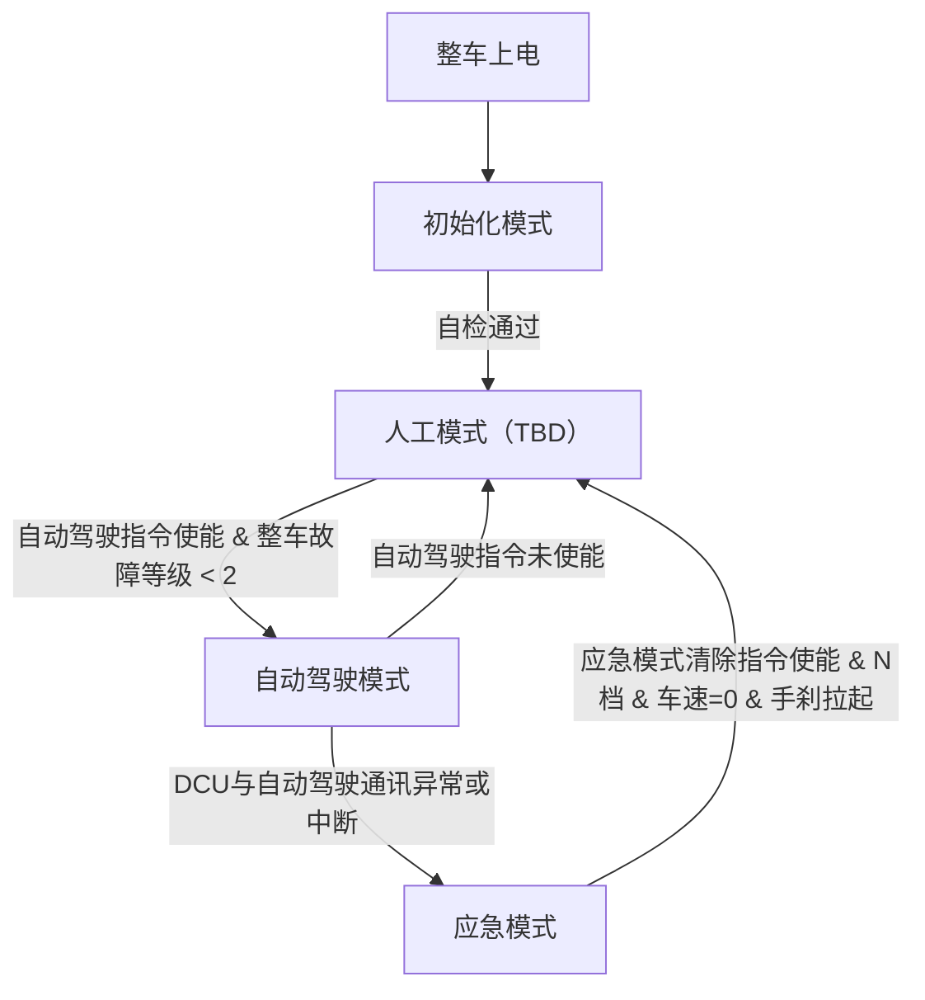

# DCU 需求说明书

## 一、 引言

### 1.1 目的

本文主要面向线控底盘开发人员，旨在清晰地说明域控制器（DCU）如何与自动驾驶系统协同工作，提供安全、可靠、易用的底盘通信与控制服务。

### 1.2 系统范围

本文主要介绍与自动驾驶相关的域控制器（DCU）功能需求。主要包括：

驾驶模式及跳转需求；

整车故障处理需求；

冗余服务需求；

数据记录与辅助诊断需求。

### 1.3 术语定义

| **缩写、术语** | **解 释**                                                    |
| -------------- | ------------------------------------------------------------ |
| DCU            | Domain Control Unit DCU，负责连接自动驾驶域与底盘域          |
| 控制指令       | 自动驾驶系统下发的纵向/横向控制请求，如目标加速度、目标转向角 |
| 底盘状态       | 车辆实时运动状态，如车速、轮速、方向盘转角、横摆角速度       |
| 驾驶模式       | 由DCU根据系统状态（是否有人类监督）决定的控制权分配策略      |

## 二、 项目概述

DCU向自动驾驶系统主要提供以下核心服务：

|          |                    |                                                                 |
|----------|--------------------|-----------------------------------------------------------------|
| 服务类别 | 服务名称           | 描述                                                            |
| 控制服务 | 车辆运动控制       | 接收自动驾驶系统的纵向/横向控制指令，安全可靠地转发至底盘执行器 |
| 反馈服务 | 底盘状态订阅       | 周期性提供车速、轮速、转向状态、制动压力等关键状态量            |
| 冗余服务 | 主/冗余CAN自动切换 | 在通信故障时自动切换通道，确保控制指令不中断                    |
| 安全服务 | 信号校验           | 对控制指令进行身份验证，防止非法注入                            |
| 数据服务 | CAN数据记录与回放  | 记录底盘通信数据，支持离线分析和算法迭代                        |
| 硬线服务 | 上装设备控制       | 提供特种车辆上装设备的硬线控制接口（如取力器、液压泵）          |
| 电源服务 | 上下电管理         | 根据自动驾驶系统的请求或物理开关控制整车电源模式                |

## 三、 功能需求

DCU应合理设计运行模式，并对关键故障做出应急操作以保证车辆安全。

DCU应设计故障管理与故障诊断模块，统计整车所有部件故障码，提供整车故障代码表，各部件的故障统一整理并分别提供各模块故障等级。

DCU对线控底盘所有部件的控制与反馈信号做映射处理，保证线控底盘对自动驾驶的接口协议统一，与自动驾驶通讯的CAN通道协议设计应按照希迪智驾无人驾驶线控通讯协议设计。

DCU应与底盘各部件设计冗余CAN通道以保证通讯及安全，支撑自动驾驶完成降级操作。

DCU应内置数据记录功能，为算法开发及测试提供高保真的实车数据。

### 3.1 驾驶模式与故障处理

根据不同应用场景，DCU应设计初始化、人工、自动驾驶、应急等多种模式以应对各种驾驶需求，并设计合理的优先级及进入条件。整车驾驶模式应包含但不限于以下模式。

#### 3.1.1 初始化模式

整车上电初始化进入初始化模式，该模式下整车处于上电自检状态，禁止一切指令操作（包括人工指令及自动驾驶指令）。

#### 3.1.2 人工模式（TBD）

整车自检通过后即可进入人工模式等待，自动驾驶指令未使能时车辆处于此模式。

#### 3.1.3 自动驾驶模式

全无人自动驾驶指令使能可进入自动驾驶模式。此模式优先级最高，忽略安全员的Override操作。

注：自动驾驶指令可分模块使能；纯纵向自动驾驶使能不影响人工操作方向盘，纯横向自动驾驶使能不影响人工操作车辆换挡、加速、制动等功能。

#### 3.1.4 应急模式

当车辆处于自动驾驶模式时DCU监测到智能驾驶的报文异常或通讯中断进入应急模式。该模式下DCU同时下发行车制动（最大制动力）与驻车制动请求，控制车辆紧急停车。车辆静止并手刹拉起后可通过应急模式清除指令（硬线清除信号/CAN协议指令清除信号）跳转到人工模式。

### 3.2 模式跳转设计

跳转规则遵循“安全优先、分级触发、双向交互”原则，结合故障分级、驾驶员操作、自动驾驶指令三大触发条件，跳转过程无卡顿（跳转时间≤10ms），跳转后同步向自动驾驶DCU、驾驶员推送模式状态与原因。

#### 3.2.1 模式跳转状态机

### 3.3 故障管理与诊断

DCU应统计整车所有部件故障码，提供整车故障代码表，各部件的故障统一整理并分别提供各模块故障等级。

#### 3.3.1 整车故障管理

故障监测范围：DCU需实时监测线控底盘系统及相关接口的各类故障，涵盖线控底盘执行器故障、线控底盘传感器故障（位置传感器、压力传感器、速度传感器信号异常）、线控底盘硬线接口故障（短路、断路、接触不良）及CAN 总线通讯故障等，确保无故障遗漏。

故障分级与识别：线控底盘故障按严重程度分为三级，与自动驾驶通讯接口故障分级标准保持一致：一级故障（轻微故障，不影响驾驶基本功能，仅提示预警）、二级故障（严重故障，驾驶降权运行，需关注）、三级故障（下高压，整车无法正常工作，需触发应急停车/接管），需准确识别故障类型、故障位置及故障触发原因。（TBD）

故障上报机制：线控底盘各类故障检测后，通过CAN 总线（遵循CAN 2.0B协议）同步上传至自动驾驶系统，故障信息需包含故障类型、故障等级等，确保自动驾驶系统同步掌握底盘故障状态。

DCU整理后的故障通过整车故障代码信号反馈，多故障时故障代码循环播报，故障代码设计应结合故障等级合理分布。各模块故障等级应单独设计一帧报文统一反馈。

### 3.4 底盘信号映射需求

DCU作为自动驾驶与线控底盘交互的唯一接口，应能够准确、安全、可靠地完成底盘各部件CAN信号与自动驾驶控制协议的映射转换，保障不同车型的DCU对外接口一致性，支撑自动驾驶域对底盘执行机构的统一控制。

对于特种车辆，自动驾驶系统可能需要控制上装设备（如搅拌罐旋转、自卸车举升）。DCU提供硬线输出接口，自动驾驶系统通过CAN指令控制这些设备。自动驾驶系统可能需要远程唤醒车辆或控制下电，DCU应提供电源模式控制接口。

自动驾驶控制接口设计参考希迪无人驾驶线控通讯协议，如有新增可进行版本迭代。

#### 3.4.1 性能需求

映射延迟：DCU完成CAN信号与硬线信号的映射转换延迟需≤10ms，确保自动驾驶系统的控制指令能够及时传递至线控底盘，线控底盘的状态反馈能够及时上传至自动驾驶系统，满足自动驾驶控制的实时性要求。

传输可靠性：当出现信号异常（如信号缺失、信号超出合理范围）时，DCU需及时检测并触发故障报警，同时采取默认安全策略（丢失信号做空报文处理），确保整车运行安全。

#### 3.4.2 上装设备控制接口（示例）

上装设备接口需充分考虑不同车型的硬线功能拓展，需与重汽具体沟通硬线资源预留需求。

|          |                              |                |
|----------|------------------------------|----------------|
| 设备     | 控制信号                     | 说明           |
| 取力器   | PTO_Enable (BOOL)            | 使能取力器啮合 |
| 液压泵   | Hydraulic_Pump_Enable (BOOL) | 启动液压泵     |
| 翻斗升降 | Dump_Up/Down (2-bit)         | 控制举升/下降  |
| 警示灯   | Warning_Light_Enable (BOOL)  | 控制外部警示灯 |

使用约束：

- 自动驾驶系统需在控制指令中携带安全互锁条件（如车速\<3km/h、档位为N/P）。

- DCU会二次校验互锁条件，不满足时拒绝执行并返回故障码。

#### 3.4.3 上下电管理

|          |                                  |
|----------|----------------------------------|
| 模式     | 描述                             |
| 高压上电 | 整车高压上电                     |
| 高压下电 | 整车高压下电，需满足车速=0等条件 |

使用约束：

- 自动驾驶系统应在车辆停止（车速=0）拉手刹后才可请求下电。

- 若DCU检测到车辆行驶中收到下电请求，将忽略并上报诊断。

### 3.5 冗余CAN设计

依据重汽现行冗余电器架构，正常工况下DCU的控制指令通过V-CAN 经中央网关转发至P-CAN；同时DCU设计冗余CAN通道直接连接P-CAN，在网关CAN通道异常及失效时，能够反馈通讯异常故障，并直接通过冗余CAN通道直接控制车辆运动功能。冗余通道为安全级备份通道，仅承载底盘安全控制指令。

#### 3.5.1 核心设计原则

1.  物理隔离：冗余 CAN 必须使用独立 CAN 控制器、独立收发器、独立总线，不与主 CAN 共用物理层。不经过网关、不经过其他域控制器，实现DCU -底盘执行器端到端直连。

2.  容错优先：支持热备切换，切换时间≤10ms（人眼不可感知），关键指令（如制动、转向）需双路一致性校验，不一致立即触发安全状态。

#### 3.5.2 核心容错策略（套件内部闭环）

1.  接收端对双 CAN 通道数据比对，一致则执行，不一致触发故障预警（2 级），持续 3 帧不一致则切换至冗余通道并降权

2.  心跳监控：双通道互发心跳帧（周期 10ms），丢失心跳≥3 次判定通道失效，立即切换并上报故障（3 级）。

3.  互斥机制：

    同一时刻只允许一个通道有效，禁止主通道与冗余通道同时发控制指令。

    冗余通道激活后，屏蔽主通道所有控制指令，防止指令冲突。

4.  故障分级处理：

    1 级（单通道偶发错误）：持续监测，不影响功能；

    2 级（单通道稳定失效）：切换至冗余通道，限制非关键指令；

    3 级（双通道同时异常 / 核心指令丢失）：立即触发应急停机（制动 / 转向安全降级），切断非关键控制。

### 3.6 数据记录需求（外置记录设备）

底盘预留P-CAN、V-CAN、EP-CAN以及DCU-智驾 CAN通道数据记录接口，连接外置CAN数据记录设备，为算法开发及测试提供高保真的实车数据。

#### 3.6.1 记录配置

开发者可通过UDS或以太网配置记录参数：

- 记录内容：选择需要记录的CAN通道（主、冗余、内部信号）。

- 触发方式：连续记录、事件触发（如故障、特定信号阈值）。

- 存储管理：循环覆盖或锁定存储，支持按行程分割文件（保证记录时长大于30天）。

#### 3.6.2 数据导出

支持以下导出方式：

- 以太网（DoIP）：通过诊断工具远程下载。

- 无线（4G/5G，若 T-Box 集成）：可配置上传至云端。（建议）

#### 3.6.3 数据格式

- 标准 ASC 格式，与常用分析工具（CANalyzer、CANape、Wireshark）兼容。

- 包含全局时间戳（UTC，同步于自动驾驶域）。
