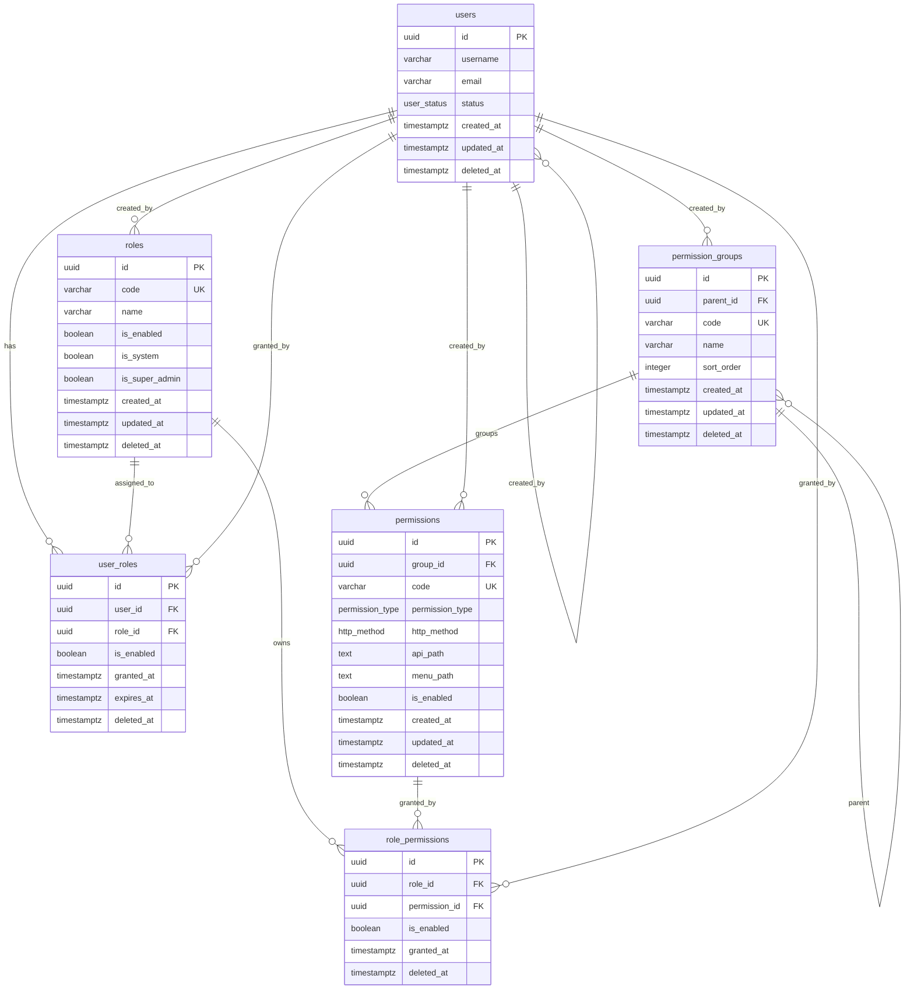

# RBAC 权限系统设计文档

## 1. 文档目标

本文档描述一套基于 **PostgreSQL 18** 的生产级 RBAC（Role-Based Access Control，基于角色的访问控制）权限系统设计。

设计目标：

* 实现标准 RBAC 模型：`User → Role → Permission`
* 支持用户与角色多对多关系
* 支持角色与权限多对多关系
* 支持超级管理员
* 支持权限分组
* 支持权限编码 `Permission Code`
* 支持菜单权限、接口权限、操作权限、数据权限扩展
* 支持角色启用 / 禁用
* 支持软删除
* 支持审计字段
* 使用 PostgreSQL 18 原生 `uuidv7()`
* 使用 `TIMESTAMPTZ`
* 适配 Rust Axum 后端项目

---

# 2. 总体架构设计

## 2.1 RBAC 模型

系统采用标准 RBAC 模型：

```text
User → UserRole → Role → RolePermission → Permission
```

核心实体：

| 实体                  | 说明         |
|---------------------|------------|
| `users`             | 用户表        |
| `roles`             | 角色表        |
| `permissions`       | 权限表，最小授权单元 |
| `permission_groups` | 权限分组表      |
| `user_roles`        | 用户与角色关联表   |
| `role_permissions`  | 角色与权限关联表   |
| `rbac_audit_logs`   | RBAC 审计日志表 |

---

## 2.2 权限编码设计

权限是系统中最小的授权单元，使用唯一权限编码表示。

示例：

```text
user:view
user:create
user:update
user:delete

role:view
role:create
role:update
role:delete

system:config
```

权限编码规则建议：

```text
模块:动作
```

例如：

```text
user:update
order:refund
system:config
```

---

## 2.3 设计原则

### 2.3.1 用户不直接绑定权限

用户不直接拥有权限，而是通过角色间接获得权限。

原因：

* 保持 RBAC 模型清晰
* 便于权限批量管理
* 便于审计权限来源
* 避免用户级权限膨胀

---

### 2.3.2 超级管理员通过角色实现

推荐使用系统内置角色实现超级管理员：

```text
roles.code = 'super_admin'
roles.is_super_admin = true
roles.is_system = true
```

不推荐在 `users` 表中直接增加：

```text
users.is_super_admin
```

原因：

* 会破坏标准 RBAC 模型
* 难以审计权限来源
* 容易造成越权风险

---

### 2.3.3 软删除策略

核心业务表均使用：

```text
deleted_at IS NULL
```

判断数据是否有效。

软删除字段：

```text
deleted_at
deleted_by
```

优势：

* 支持恢复
* 支持审计
* 保留历史授权记录
* 避免物理删除导致审计链断裂

---

### 2.3.4 审计字段

核心表统一包含：

```text
created_at
updated_at
deleted_at
created_by
updated_by
deleted_by
version
```

其中：

* `created_by`
* `updated_by`
* `deleted_by`

均外键关联：

```text
users.id
```

---

# 3. ER 图



---

# 4. 表结构设计

## 4.1 users

用户表。

| 字段              | 类型             | 默认值        | NULL | 用途     |
|-----------------|----------------|------------|------|--------|
| `id`            | `uuid`         | `uuidv7()` | 否    | 用户主键   |
| `username`      | `varchar(64)`  | 无          | 否    | 用户名    |
| `email`         | `varchar(320)` | 无          | 否    | 邮箱     |
| `password_hash` | `text`         | 无          | 是    | 密码哈希   |
| `display_name`  | `varchar(128)` | 无          | 是    | 展示名    |
| `status`        | `user_status`  | `'active'` | 否    | 用户状态   |
| `last_login_at` | `timestamptz`  | 无          | 是    | 最近登录时间 |
| `created_at`    | `timestamptz`  | `now()`    | 否    | 创建时间   |
| `updated_at`    | `timestamptz`  | `now()`    | 否    | 更新时间   |
| `deleted_at`    | `timestamptz`  | 无          | 是    | 软删除时间  |
| `created_by`    | `uuid`         | 无          | 是    | 创建人    |
| `updated_by`    | `uuid`         | 无          | 是    | 更新人    |
| `deleted_by`    | `uuid`         | 无          | 是    | 删除人    |
| `version`       | `bigint`       | `0`        | 否    | 乐观锁版本  |

---

## 4.2 roles

角色表。

| 字段               | 类型             | 默认值        | NULL | 用途        |
|------------------|----------------|------------|------|-----------|
| `id`             | `uuid`         | `uuidv7()` | 否    | 角色主键      |
| `code`           | `varchar(64)`  | 无          | 否    | 角色编码      |
| `name`           | `varchar(128)` | 无          | 否    | 角色名称      |
| `description`    | `text`         | 无          | 是    | 角色描述      |
| `is_enabled`     | `boolean`      | `true`     | 否    | 是否启用      |
| `is_system`      | `boolean`      | `false`    | 否    | 是否系统内置    |
| `is_super_admin` | `boolean`      | `false`    | 否    | 是否超级管理员角色 |
| `sort_order`     | `integer`      | `0`        | 否    | 排序        |
| `created_at`     | `timestamptz`  | `now()`    | 否    | 创建时间      |
| `updated_at`     | `timestamptz`  | `now()`    | 否    | 更新时间      |
| `deleted_at`     | `timestamptz`  | 无          | 是    | 软删除时间     |
| `created_by`     | `uuid`         | 无          | 是    | 创建人       |
| `updated_by`     | `uuid`         | 无          | 是    | 更新人       |
| `deleted_by`     | `uuid`         | 无          | 是    | 删除人       |
| `version`        | `bigint`       | `0`        | 否    | 乐观锁版本     |

---

## 4.3 permission_groups

权限分组表。

推荐保留该表，原因：

* 便于后台权限管理页面分组展示
* 便于大型系统按模块维护权限
* 支持树形权限分组
* 支持菜单和接口权限归类

| 字段            | 类型             | 默认值        | NULL | 用途     |
|---------------|----------------|------------|------|--------|
| `id`          | `uuid`         | `uuidv7()` | 否    | 权限分组主键 |
| `parent_id`   | `uuid`         | 无          | 是    | 父级分组   |
| `code`        | `varchar(64)`  | 无          | 否    | 分组编码   |
| `name`        | `varchar(128)` | 无          | 否    | 分组名称   |
| `description` | `text`         | 无          | 是    | 描述     |
| `sort_order`  | `integer`      | `0`        | 否    | 排序     |
| `created_at`  | `timestamptz`  | `now()`    | 否    | 创建时间   |
| `updated_at`  | `timestamptz`  | `now()`    | 否    | 更新时间   |
| `deleted_at`  | `timestamptz`  | 无          | 是    | 软删除时间  |
| `created_by`  | `uuid`         | 无          | 是    | 创建人    |
| `updated_by`  | `uuid`         | 无          | 是    | 更新人    |
| `deleted_by`  | `uuid`         | 无          | 是    | 删除人    |
| `version`     | `bigint`       | `0`        | 否    | 乐观锁版本  |

---

## 4.4 permissions

权限表。

| 字段                | 类型                | 默认值        | NULL | 用途      |
|-------------------|-------------------|------------|------|---------|
| `id`              | `uuid`            | `uuidv7()` | 否    | 权限主键    |
| `group_id`        | `uuid`            | 无          | 是    | 权限分组 ID |
| `code`            | `varchar(128)`    | 无          | 否    | 权限编码    |
| `name`            | `varchar(128)`    | 无          | 否    | 权限名称    |
| `description`     | `text`            | 无          | 是    | 权限描述    |
| `permission_type` | `permission_type` | `'action'` | 否    | 权限类型    |
| `http_method`     | `http_method`     | 无          | 是    | HTTP 方法 |
| `api_path`        | `text`            | 无          | 是    | API 路径  |
| `menu_path`       | `text`            | 无          | 是    | 菜单路径    |
| `menu_component`  | `text`            | 无          | 是    | 菜单组件    |
| `menu_icon`       | `varchar(64)`     | 无          | 是    | 菜单图标    |
| `sort_order`      | `integer`         | `0`        | 否    | 排序      |
| `is_enabled`      | `boolean`         | `true`     | 否    | 是否启用    |
| `metadata`        | `jsonb`           | `'{}'`     | 否    | 扩展元数据   |
| `created_at`      | `timestamptz`     | `now()`    | 否    | 创建时间    |
| `updated_at`      | `timestamptz`     | `now()`    | 否    | 更新时间    |
| `deleted_at`      | `timestamptz`     | 无          | 是    | 软删除时间   |
| `created_by`      | `uuid`            | 无          | 是    | 创建人     |
| `updated_by`      | `uuid`            | 无          | 是    | 更新人     |
| `deleted_by`      | `uuid`            | 无          | 是    | 删除人     |
| `version`         | `bigint`          | `0`        | 否    | 乐观锁版本   |

权限类型：

| 类型       | 说明     |
|----------|--------|
| `menu`   | 菜单权限   |
| `api`    | 接口权限   |
| `action` | 操作权限   |
| `data`   | 数据权限扩展 |

---

## 4.5 user_roles

用户角色关联表。

| 字段           | 类型            | 默认值        | NULL | 用途    |
|--------------|---------------|------------|------|-------|
| `id`         | `uuid`        | `uuidv7()` | 否    | 关联主键  |
| `user_id`    | `uuid`        | 无          | 否    | 用户 ID |
| `role_id`    | `uuid`        | 无          | 否    | 角色 ID |
| `is_enabled` | `boolean`     | `true`     | 否    | 是否启用  |
| `granted_at` | `timestamptz` | `now()`    | 否    | 授权时间  |
| `expires_at` | `timestamptz` | 无          | 是    | 过期时间  |
| `created_at` | `timestamptz` | `now()`    | 否    | 创建时间  |
| `updated_at` | `timestamptz` | `now()`    | 否    | 更新时间  |
| `deleted_at` | `timestamptz` | 无          | 是    | 软删除时间 |
| `created_by` | `uuid`        | 无          | 是    | 授权人   |
| `updated_by` | `uuid`        | 无          | 是    | 更新人   |
| `deleted_by` | `uuid`        | 无          | 是    | 撤销人   |
| `version`    | `bigint`      | `0`        | 否    | 乐观锁版本 |

---

## 4.6 role_permissions

角色权限关联表。

| 字段              | 类型            | 默认值        | NULL | 用途    |
|-----------------|---------------|------------|------|-------|
| `id`            | `uuid`        | `uuidv7()` | 否    | 关联主键  |
| `role_id`       | `uuid`        | 无          | 否    | 角色 ID |
| `permission_id` | `uuid`        | 无          | 否    | 权限 ID |
| `is_enabled`    | `boolean`     | `true`     | 否    | 是否启用  |
| `granted_at`    | `timestamptz` | `now()`    | 否    | 授权时间  |
| `created_at`    | `timestamptz` | `now()`    | 否    | 创建时间  |
| `updated_at`    | `timestamptz` | `now()`    | 否    | 更新时间  |
| `deleted_at`    | `timestamptz` | 无          | 是    | 软删除时间 |
| `created_by`    | `uuid`        | 无          | 是    | 授权人   |
| `updated_by`    | `uuid`        | 无          | 是    | 更新人   |
| `deleted_by`    | `uuid`        | 无          | 是    | 撤销人   |
| `version`       | `bigint`      | `0`        | 否    | 乐观锁版本 |

---

# 5. PostgreSQL 18 DDL

```sql
CREATE SCHEMA IF NOT EXISTS iam;

SET search_path = iam, public;

-- =========================================================
-- ENUM TYPES
-- =========================================================

CREATE TYPE user_status AS ENUM (
    'active',
    'disabled',
    'locked',
    'pending'
    );

CREATE TYPE permission_type AS ENUM (
    'menu',
    'api',
    'action',
    'data'
    );

CREATE TYPE http_method AS ENUM (
    'GET',
    'POST',
    'PUT',
    'PATCH',
    'DELETE',
    'HEAD',
    'OPTIONS'
    );

CREATE TYPE audit_action AS ENUM (
    'create',
    'update',
    'soft_delete',
    'restore',
    'grant_role',
    'revoke_role',
    'grant_permission',
    'revoke_permission',
    'login',
    'logout',
    'permission_check',
    'access_denied'
    );

-- =========================================================
-- COMMON TRIGGER FUNCTION
-- =========================================================

CREATE OR REPLACE FUNCTION iam.set_updated_at()
    RETURNS trigger
    LANGUAGE plpgsql
AS
$$
BEGIN
    NEW.updated_at = now();
    NEW.version = OLD.version + 1;
    RETURN NEW;
END;
$$;

-- =========================================================
-- USERS
-- =========================================================

CREATE TABLE iam.users
(
    id            uuid PRIMARY KEY      DEFAULT uuidv7(),

    username      varchar(64)  NOT NULL,
    email         varchar(320) NOT NULL,
    password_hash text,
    display_name  varchar(128),

    status        user_status  NOT NULL DEFAULT 'active',
    last_login_at timestamptz,

    created_at    timestamptz  NOT NULL DEFAULT now(),
    updated_at    timestamptz  NOT NULL DEFAULT now(),
    deleted_at    timestamptz,

    created_by    uuid,
    updated_by    uuid,
    deleted_by    uuid,

    version       bigint       NOT NULL DEFAULT 0,

    CONSTRAINT uk_users_username UNIQUE (username),
    CONSTRAINT uk_users_email UNIQUE (email),

    CONSTRAINT chk_users_username_format
        CHECK (username ~ '^[a-zA-Z][a-zA-Z0-9_.-]{2,63}$'),

    CONSTRAINT chk_users_email_format
        CHECK (email ~* '^[A-Z0-9._%+-]+@[A-Z0-9.-]+\.[A-Z]{2,}$'),

    CONSTRAINT chk_users_password_hash_length
        CHECK (password_hash IS NULL OR length(password_hash) >= 20),

    CONSTRAINT chk_users_deleted_by_requires_deleted_at
        CHECK (deleted_by IS NULL OR deleted_at IS NOT NULL),

    CONSTRAINT fk_users_created_by
        FOREIGN KEY (created_by) REFERENCES iam.users (id) ON DELETE SET NULL,

    CONSTRAINT fk_users_updated_by
        FOREIGN KEY (updated_by) REFERENCES iam.users (id) ON DELETE SET NULL,

    CONSTRAINT fk_users_deleted_by
        FOREIGN KEY (deleted_by) REFERENCES iam.users (id) ON DELETE SET NULL
);

CREATE INDEX idx_users_status
    ON iam.users (status)
    WHERE deleted_at IS NULL;

CREATE INDEX idx_users_created_at
    ON iam.users (created_at DESC);

CREATE INDEX idx_users_deleted_at
    ON iam.users (deleted_at)
    WHERE deleted_at IS NOT NULL;

CREATE TRIGGER trg_users_set_updated_at
    BEFORE UPDATE
    ON iam.users
    FOR EACH ROW
EXECUTE FUNCTION iam.set_updated_at();

-- =========================================================
-- ROLES
-- =========================================================

CREATE TABLE iam.roles
(
    id             uuid PRIMARY KEY      DEFAULT uuidv7(),

    code           varchar(64)  NOT NULL,
    name           varchar(128) NOT NULL,
    description    text,

    is_enabled     boolean      NOT NULL DEFAULT true,
    is_system      boolean      NOT NULL DEFAULT false,
    is_super_admin boolean      NOT NULL DEFAULT false,

    sort_order     integer      NOT NULL DEFAULT 0,

    created_at     timestamptz  NOT NULL DEFAULT now(),
    updated_at     timestamptz  NOT NULL DEFAULT now(),
    deleted_at     timestamptz,

    created_by     uuid,
    updated_by     uuid,
    deleted_by     uuid,

    version        bigint       NOT NULL DEFAULT 0,

    CONSTRAINT uk_roles_code UNIQUE (code),

    CONSTRAINT chk_roles_code_format
        CHECK (code ~ '^[a-z][a-z0-9_:-]{1,63}$'),

    CONSTRAINT chk_roles_sort_order_non_negative
        CHECK (sort_order >= 0),

    CONSTRAINT chk_roles_deleted_by_requires_deleted_at
        CHECK (deleted_by IS NULL OR deleted_at IS NOT NULL),

    CONSTRAINT fk_roles_created_by
        FOREIGN KEY (created_by) REFERENCES iam.users (id) ON DELETE SET NULL,

    CONSTRAINT fk_roles_updated_by
        FOREIGN KEY (updated_by) REFERENCES iam.users (id) ON DELETE SET NULL,

    CONSTRAINT fk_roles_deleted_by
        FOREIGN KEY (deleted_by) REFERENCES iam.users (id) ON DELETE SET NULL
);

CREATE INDEX idx_roles_enabled
    ON iam.roles (is_enabled)
    WHERE deleted_at IS NULL;

CREATE INDEX idx_roles_super_admin
    ON iam.roles (is_super_admin)
    WHERE deleted_at IS NULL AND is_enabled = true;

CREATE INDEX idx_roles_sort_order
    ON iam.roles (sort_order, created_at DESC)
    WHERE deleted_at IS NULL;

CREATE TRIGGER trg_roles_set_updated_at
    BEFORE UPDATE
    ON iam.roles
    FOR EACH ROW
EXECUTE FUNCTION iam.set_updated_at();

-- =========================================================
-- PERMISSION GROUPS
-- =========================================================

CREATE TABLE iam.permission_groups
(
    id          uuid PRIMARY KEY      DEFAULT uuidv7(),

    parent_id   uuid,
    code        varchar(64)  NOT NULL,
    name        varchar(128) NOT NULL,
    description text,
    sort_order  integer      NOT NULL DEFAULT 0,

    created_at  timestamptz  NOT NULL DEFAULT now(),
    updated_at  timestamptz  NOT NULL DEFAULT now(),
    deleted_at  timestamptz,

    created_by  uuid,
    updated_by  uuid,
    deleted_by  uuid,

    version     bigint       NOT NULL DEFAULT 0,

    CONSTRAINT uk_permission_groups_code UNIQUE (code),

    CONSTRAINT chk_permission_groups_code_format
        CHECK (code ~ '^[a-z][a-z0-9_:-]{1,63}$'),

    CONSTRAINT chk_permission_groups_sort_order_non_negative
        CHECK (sort_order >= 0),

    CONSTRAINT chk_permission_groups_not_self_parent
        CHECK (parent_id IS NULL OR parent_id <> id),

    CONSTRAINT chk_permission_groups_deleted_by_requires_deleted_at
        CHECK (deleted_by IS NULL OR deleted_at IS NOT NULL),

    CONSTRAINT fk_permission_groups_parent
        FOREIGN KEY (parent_id) REFERENCES iam.permission_groups (id) ON DELETE SET NULL,

    CONSTRAINT fk_permission_groups_created_by
        FOREIGN KEY (created_by) REFERENCES iam.users (id) ON DELETE SET NULL,

    CONSTRAINT fk_permission_groups_updated_by
        FOREIGN KEY (updated_by) REFERENCES iam.users (id) ON DELETE SET NULL,

    CONSTRAINT fk_permission_groups_deleted_by
        FOREIGN KEY (deleted_by) REFERENCES iam.users (id) ON DELETE SET NULL
);

CREATE INDEX idx_permission_groups_parent
    ON iam.permission_groups (parent_id)
    WHERE deleted_at IS NULL;

CREATE INDEX idx_permission_groups_sort_order
    ON iam.permission_groups (sort_order, created_at DESC)
    WHERE deleted_at IS NULL;

CREATE TRIGGER trg_permission_groups_set_updated_at
    BEFORE UPDATE
    ON iam.permission_groups
    FOR EACH ROW
EXECUTE FUNCTION iam.set_updated_at();

-- =========================================================
-- PERMISSIONS
-- =========================================================

CREATE TABLE iam.permissions
(
    id              uuid PRIMARY KEY         DEFAULT uuidv7(),

    group_id        uuid,

    code            varchar(128)    NOT NULL,
    name            varchar(128)    NOT NULL,
    description     text,

    permission_type permission_type NOT NULL DEFAULT 'action',

    http_method     http_method,
    api_path        text,

    menu_path       text,
    menu_component  text,
    menu_icon       varchar(64),

    sort_order      integer         NOT NULL DEFAULT 0,
    is_enabled      boolean         NOT NULL DEFAULT true,

    metadata        jsonb           NOT NULL DEFAULT '{}'::jsonb,

    created_at      timestamptz     NOT NULL DEFAULT now(),
    updated_at      timestamptz     NOT NULL DEFAULT now(),
    deleted_at      timestamptz,

    created_by      uuid,
    updated_by      uuid,
    deleted_by      uuid,

    version         bigint          NOT NULL DEFAULT 0,

    CONSTRAINT uk_permissions_code UNIQUE (code),

    CONSTRAINT chk_permissions_code_format
        CHECK (code ~ '^[a-z][a-z0-9_]*(?::[a-z][a-z0-9_]*)+$'),

    CONSTRAINT chk_permissions_sort_order_non_negative
        CHECK (sort_order >= 0),

    CONSTRAINT chk_permissions_metadata_object
        CHECK (jsonb_typeof(metadata) = 'object'),

    CONSTRAINT chk_permissions_api_fields
        CHECK (
            permission_type <> 'api'
                OR (http_method IS NOT NULL AND api_path IS NOT NULL)
            ),

    CONSTRAINT chk_permissions_non_api_http_method
        CHECK (
            permission_type = 'api'
                OR http_method IS NULL
            ),

    CONSTRAINT chk_permissions_menu_fields
        CHECK (
            permission_type <> 'menu'
                OR menu_path IS NOT NULL
            ),

    CONSTRAINT chk_permissions_deleted_by_requires_deleted_at
        CHECK (deleted_by IS NULL OR deleted_at IS NOT NULL),

    CONSTRAINT fk_permissions_group
        FOREIGN KEY (group_id) REFERENCES iam.permission_groups (id) ON DELETE SET NULL,

    CONSTRAINT fk_permissions_created_by
        FOREIGN KEY (created_by) REFERENCES iam.users (id) ON DELETE SET NULL,

    CONSTRAINT fk_permissions_updated_by
        FOREIGN KEY (updated_by) REFERENCES iam.users (id) ON DELETE SET NULL,

    CONSTRAINT fk_permissions_deleted_by
        FOREIGN KEY (deleted_by) REFERENCES iam.users (id) ON DELETE SET NULL
);

CREATE INDEX idx_permissions_group
    ON iam.permissions (group_id)
    WHERE deleted_at IS NULL;

CREATE INDEX idx_permissions_type
    ON iam.permissions (permission_type)
    WHERE deleted_at IS NULL AND is_enabled = true;

CREATE INDEX idx_permissions_api_lookup
    ON iam.permissions (http_method, api_path)
    WHERE deleted_at IS NULL
        AND is_enabled = true
        AND permission_type = 'api';

CREATE INDEX idx_permissions_menu_lookup
    ON iam.permissions (menu_path)
    WHERE deleted_at IS NULL
        AND is_enabled = true
        AND permission_type = 'menu';

CREATE INDEX idx_permissions_sort_order
    ON iam.permissions (sort_order, created_at DESC)
    WHERE deleted_at IS NULL;

CREATE TRIGGER trg_permissions_set_updated_at
    BEFORE UPDATE
    ON iam.permissions
    FOR EACH ROW
EXECUTE FUNCTION iam.set_updated_at();

-- =========================================================
-- USER_ROLES
-- =========================================================

CREATE TABLE iam.user_roles
(
    id         uuid PRIMARY KEY     DEFAULT uuidv7(),

    user_id    uuid        NOT NULL,
    role_id    uuid        NOT NULL,

    is_enabled boolean     NOT NULL DEFAULT true,
    granted_at timestamptz NOT NULL DEFAULT now(),
    expires_at timestamptz,

    created_at timestamptz NOT NULL DEFAULT now(),
    updated_at timestamptz NOT NULL DEFAULT now(),
    deleted_at timestamptz,

    created_by uuid,
    updated_by uuid,
    deleted_by uuid,

    version    bigint      NOT NULL DEFAULT 0,

    CONSTRAINT chk_user_roles_expires_at
        CHECK (expires_at IS NULL OR expires_at > granted_at),

    CONSTRAINT chk_user_roles_deleted_by_requires_deleted_at
        CHECK (deleted_by IS NULL OR deleted_at IS NOT NULL),

    CONSTRAINT fk_user_roles_user
        FOREIGN KEY (user_id) REFERENCES iam.users (id) ON DELETE CASCADE,

    CONSTRAINT fk_user_roles_role
        FOREIGN KEY (role_id) REFERENCES iam.roles (id) ON DELETE CASCADE,

    CONSTRAINT fk_user_roles_created_by
        FOREIGN KEY (created_by) REFERENCES iam.users (id) ON DELETE SET NULL,

    CONSTRAINT fk_user_roles_updated_by
        FOREIGN KEY (updated_by) REFERENCES iam.users (id) ON DELETE SET NULL,

    CONSTRAINT fk_user_roles_deleted_by
        FOREIGN KEY (deleted_by) REFERENCES iam.users (id) ON DELETE SET NULL
);

CREATE UNIQUE INDEX uk_user_roles_active_user_role
    ON iam.user_roles (user_id, role_id)
    WHERE deleted_at IS NULL;

CREATE INDEX idx_user_roles_user_active
    ON iam.user_roles (user_id, role_id)
    WHERE deleted_at IS NULL
        AND is_enabled = true;

CREATE INDEX idx_user_roles_role_active
    ON iam.user_roles (role_id, user_id)
    WHERE deleted_at IS NULL
        AND is_enabled = true;

CREATE INDEX idx_user_roles_expires_at
    ON iam.user_roles (expires_at)
    WHERE deleted_at IS NULL
        AND expires_at IS NOT NULL;

CREATE TRIGGER trg_user_roles_set_updated_at
    BEFORE UPDATE
    ON iam.user_roles
    FOR EACH ROW
EXECUTE FUNCTION iam.set_updated_at();

-- =========================================================
-- ROLE_PERMISSIONS
-- =========================================================

CREATE TABLE iam.role_permissions
(
    id            uuid PRIMARY KEY     DEFAULT uuidv7(),

    role_id       uuid        NOT NULL,
    permission_id uuid        NOT NULL,

    is_enabled    boolean     NOT NULL DEFAULT true,
    granted_at    timestamptz NOT NULL DEFAULT now(),

    created_at    timestamptz NOT NULL DEFAULT now(),
    updated_at    timestamptz NOT NULL DEFAULT now(),
    deleted_at    timestamptz,

    created_by    uuid,
    updated_by    uuid,
    deleted_by    uuid,

    version       bigint      NOT NULL DEFAULT 0,

    CONSTRAINT chk_role_permissions_deleted_by_requires_deleted_at
        CHECK (deleted_by IS NULL OR deleted_at IS NOT NULL),

    CONSTRAINT fk_role_permissions_role
        FOREIGN KEY (role_id) REFERENCES iam.roles (id) ON DELETE CASCADE,

    CONSTRAINT fk_role_permissions_permission
        FOREIGN KEY (permission_id) REFERENCES iam.permissions (id) ON DELETE CASCADE,

    CONSTRAINT fk_role_permissions_created_by
        FOREIGN KEY (created_by) REFERENCES iam.users (id) ON DELETE SET NULL,

    CONSTRAINT fk_role_permissions_updated_by
        FOREIGN KEY (updated_by) REFERENCES iam.users (id) ON DELETE SET NULL,

    CONSTRAINT fk_role_permissions_deleted_by
        FOREIGN KEY (deleted_by) REFERENCES iam.users (id) ON DELETE SET NULL
);

CREATE UNIQUE INDEX uk_role_permissions_active_role_permission
    ON iam.role_permissions (role_id, permission_id)
    WHERE deleted_at IS NULL;

CREATE INDEX idx_role_permissions_role_active
    ON iam.role_permissions (role_id, permission_id)
    WHERE deleted_at IS NULL
        AND is_enabled = true;

CREATE INDEX idx_role_permissions_permission_active
    ON iam.role_permissions (permission_id, role_id)
    WHERE deleted_at IS NULL
        AND is_enabled = true;

CREATE TRIGGER trg_role_permissions_set_updated_at
    BEFORE UPDATE
    ON iam.role_permissions
    FOR EACH ROW
EXECUTE FUNCTION iam.set_updated_at();

-- =========================================================
-- RBAC AUDIT LOGS
-- =========================================================

CREATE TABLE iam.rbac_audit_logs
(
    id            uuid PRIMARY KEY      DEFAULT uuidv7(),

    actor_user_id uuid,
    action        audit_action NOT NULL,

    resource_type varchar(64)  NOT NULL,
    resource_id   uuid,

    request_id    varchar(128),
    ip_address    inet,
    user_agent    text,

    before_data   jsonb,
    after_data    jsonb,

    created_at    timestamptz  NOT NULL DEFAULT now(),

    CONSTRAINT chk_rbac_audit_logs_resource_type
        CHECK (resource_type ~ '^[a-z][a-z0-9_:-]{1,63}$'),

    CONSTRAINT fk_rbac_audit_logs_actor
        FOREIGN KEY (actor_user_id) REFERENCES iam.users (id) ON DELETE SET NULL
);

CREATE INDEX idx_rbac_audit_logs_actor_created_at
    ON iam.rbac_audit_logs (actor_user_id, created_at DESC);

CREATE INDEX idx_rbac_audit_logs_resource
    ON iam.rbac_audit_logs (resource_type, resource_id, created_at DESC);

CREATE INDEX idx_rbac_audit_logs_action_created_at
    ON iam.rbac_audit_logs (action, created_at DESC);
```

---

# 6. 常用查询 SQL

## 6.1 查询用户全部角色

```sql
SELECT r.id,
       r.code,
       r.name,
       r.description,
       r.is_enabled,
       r.is_system,
       r.is_super_admin,
       ur.granted_at,
       ur.expires_at
FROM iam.user_roles ur
         JOIN iam.roles r
              ON r.id = ur.role_id
WHERE ur.user_id = $1
  AND ur.deleted_at IS NULL
  AND ur.is_enabled = true
  AND r.deleted_at IS NULL
  AND r.is_enabled = true
  AND (ur.expires_at IS NULL OR ur.expires_at > now())
ORDER BY r.sort_order ASC, r.created_at DESC;
```

---

## 6.2 查询用户全部权限

```sql
WITH active_user AS (SELECT u.id
                     FROM iam.users u
                     WHERE u.id = $1
                       AND u.deleted_at IS NULL
                       AND u.status = 'active'),
     super_admin AS (SELECT EXISTS (SELECT 1
                                    FROM active_user u
                                             JOIN iam.user_roles ur
                                                  ON ur.user_id = u.id
                                             JOIN iam.roles r
                                                  ON r.id = ur.role_id
                                    WHERE ur.deleted_at IS NULL
                                      AND ur.is_enabled = true
                                      AND (ur.expires_at IS NULL OR ur.expires_at > now())
                                      AND r.deleted_at IS NULL
                                      AND r.is_enabled = true
                                      AND r.is_super_admin = true) AS yes)
SELECT DISTINCT p.id,
                p.code,
                p.name,
                p.permission_type,
                p.http_method,
                p.api_path,
                p.menu_path,
                p.menu_component,
                p.menu_icon,
                p.group_id,
                p.sort_order
FROM iam.permissions p
WHERE p.deleted_at IS NULL
  AND p.is_enabled = true
  AND (
    (SELECT yes FROM super_admin)
        OR EXISTS (SELECT 1
                   FROM active_user u
                            JOIN iam.user_roles ur
                                 ON ur.user_id = u.id
                            JOIN iam.roles r
                                 ON r.id = ur.role_id
                            JOIN iam.role_permissions rp
                                 ON rp.role_id = r.id
                   WHERE rp.permission_id = p.id
                     AND ur.deleted_at IS NULL
                     AND ur.is_enabled = true
                     AND (ur.expires_at IS NULL OR ur.expires_at > now())
                     AND r.deleted_at IS NULL
                     AND r.is_enabled = true
                     AND rp.deleted_at IS NULL
                     AND rp.is_enabled = true)
    )
ORDER BY p.sort_order ASC, p.code ASC;
```

---

## 6.3 判断用户是否具有某权限

示例权限：

```text
user:update
```

SQL：

```sql
SELECT EXISTS (SELECT 1
               FROM iam.users u
               WHERE u.id = $1
                 AND u.deleted_at IS NULL
                 AND u.status = 'active'
                 AND (
                   EXISTS (SELECT 1
                           FROM iam.user_roles ur
                                    JOIN iam.roles r
                                         ON r.id = ur.role_id
                           WHERE ur.user_id = u.id
                             AND ur.deleted_at IS NULL
                             AND ur.is_enabled = true
                             AND (ur.expires_at IS NULL OR ur.expires_at > now())
                             AND r.deleted_at IS NULL
                             AND r.is_enabled = true
                             AND r.is_super_admin = true)
                       OR
                   EXISTS (SELECT 1
                           FROM iam.user_roles ur
                                    JOIN iam.roles r
                                         ON r.id = ur.role_id
                                    JOIN iam.role_permissions rp
                                         ON rp.role_id = r.id
                                    JOIN iam.permissions p
                                         ON p.id = rp.permission_id
                           WHERE ur.user_id = u.id
                             AND p.code = $2
                             AND ur.deleted_at IS NULL
                             AND ur.is_enabled = true
                             AND (ur.expires_at IS NULL OR ur.expires_at > now())
                             AND r.deleted_at IS NULL
                             AND r.is_enabled = true
                             AND rp.deleted_at IS NULL
                             AND rp.is_enabled = true
                             AND p.deleted_at IS NULL
                             AND p.is_enabled = true)
                   )) AS has_permission;
```

参数：

| 参数   | 含义                    |
|------|-----------------------|
| `$1` | 用户 ID                 |
| `$2` | 权限编码，例如 `user:update` |

---

## 6.4 给用户授权角色

```sql
INSERT INTO iam.user_roles (user_id,
                            role_id,
                            created_by,
                            updated_by,
                            expires_at)
VALUES ($1,
        $2,
        $3,
        $3,
        $4)
ON CONFLICT (user_id, role_id)
WHERE deleted_at IS NULL
    DO
UPDATE
SET is_enabled = true,
    expires_at = EXCLUDED.expires_at,
    updated_by = EXCLUDED.updated_by,
    updated_at = now()
RETURNING *;
```

参数：

| 参数   | 含义             |
|------|----------------|
| `$1` | 被授权用户 ID       |
| `$2` | 角色 ID          |
| `$3` | 操作人用户 ID       |
| `$4` | 过期时间，可为 `NULL` |

---

## 6.5 撤销用户角色

```sql
UPDATE iam.user_roles
SET is_enabled = false,
    deleted_at = now(),
    deleted_by = $3,
    updated_by = $3,
    updated_at = now()
WHERE user_id = $1
  AND role_id = $2
  AND deleted_at IS NULL
RETURNING *;
```

参数：

| 参数   | 含义       |
|------|----------|
| `$1` | 用户 ID    |
| `$2` | 角色 ID    |
| `$3` | 操作人用户 ID |

---

## 6.6 给角色授权权限

```sql
INSERT INTO iam.role_permissions (role_id,
                                  permission_id,
                                  created_by,
                                  updated_by)
VALUES ($1,
        $2,
        $3,
        $3)
ON CONFLICT (role_id, permission_id)
WHERE deleted_at IS NULL
    DO
UPDATE
SET is_enabled = true,
    updated_by = EXCLUDED.updated_by,
    updated_at = now()
RETURNING *;
```

参数：

| 参数   | 含义       |
|------|----------|
| `$1` | 角色 ID    |
| `$2` | 权限 ID    |
| `$3` | 操作人用户 ID |

---

## 6.7 撤销角色权限

```sql
UPDATE iam.role_permissions
SET is_enabled = false,
    deleted_at = now(),
    deleted_by = $3,
    updated_by = $3,
    updated_at = now()
WHERE role_id = $1
  AND permission_id = $2
  AND deleted_at IS NULL
RETURNING *;
```

参数：

| 参数   | 含义       |
|------|----------|
| `$1` | 角色 ID    |
| `$2` | 权限 ID    |
| `$3` | 操作人用户 ID |

---

# 7. 性能优化设计

## 7.1 核心查询路径

RBAC 高频查询路径主要有：

```text
user_id → user_roles → roles
role_id → role_permissions → permissions
permission_code → permissions
```

因此索引重点围绕：

* `user_roles.user_id`
* `user_roles.role_id`
* `role_permissions.role_id`
* `role_permissions.permission_id`
* `permissions.code`
* `roles.code`

---

## 7.2 软删除索引策略

常见查询均需要过滤：

```sql
deleted_at IS NULL
```

因此推荐使用部分索引：

```sql
WHERE deleted_at IS NULL
```

优势：

* 索引体积更小
* 减少无效数据扫描
* 提升 active 数据查询性能

---

## 7.3 百万用户规模优化

百万用户规模下，不建议每次接口请求都实时查询 PostgreSQL 多表 JOIN。

推荐：

```text
权限判断走 Redis / 本地缓存
权限管理后台走 PostgreSQL
审计日志异步写入或批量写入
```

---

## 7.4 Redis 权限缓存策略

推荐缓存用户权限集合：

```text
Key:   rbac:user:{user_id}:permissions
Type:  Set
TTL:   15 ~ 60 min
Value: permission_code
```

示例：

```text
SADD rbac:user:0197xxxx:permissions user:view user:update role:view
EXPIRE rbac:user:0197xxxx:permissions 1800
```

权限判断：

```text
SISMEMBER rbac:user:0197xxxx:permissions user:update
```

---

## 7.5 缓存失效策略

| 事件      | 处理               |
|---------|------------------|
| 给用户授权角色 | 删除该用户权限缓存        |
| 撤销用户角色  | 删除该用户权限缓存        |
| 给角色授权权限 | 删除拥有该角色的用户权限缓存   |
| 撤销角色权限  | 删除拥有该角色的用户权限缓存   |
| 禁用角色    | 删除拥有该角色的用户权限缓存   |
| 禁用权限    | 删除可能包含该权限的用户权限缓存 |
| 用户禁用    | 删除用户缓存并拒绝请求      |

---

## 7.6 权限版本号策略

建议维护权限版本号：

```text
rbac:user:{user_id}:permission_version
```

JWT 中放入：

```json
{
  "sub": "user_id",
  "perm_ver": 12
}
```

请求时比较：

```text
JWT perm_ver == Redis perm_ver
```

如果不一致：

* 重新加载权限
* 或要求重新登录
* 或拒绝当前请求

---

# 8. 安全设计

## 8.1 超级管理员

超级管理员通过角色实现：

```text
roles.code = 'super_admin'
roles.is_super_admin = true
roles.is_system = true
```

权限判断时：

```text
如果用户拥有启用中的超级管理员角色，则视为拥有所有权限
```

---

## 8.2 权限提升防护

必须防止普通管理员进行以下操作：

* 给自己授权 `super_admin`
* 给他人授权 `super_admin`
* 删除 `super_admin` 角色
* 禁用 `super_admin` 角色
* 撤销系统中最后一个超级管理员
* 修改系统内置角色
* 修改系统核心权限编码

建议业务层强制检查：

```text
只有当前操作者已经是 super_admin，才允许管理 super_admin 角色
```

---

## 8.3 系统角色保护

对于：

```text
roles.is_system = true
```

建议限制：

* 不允许删除
* 不允许随意改名
* 不允许修改 `code`
* 不允许普通管理员修改其权限

---

## 8.4 审计日志

所有敏感操作必须写入 `rbac_audit_logs`。

推荐审计操作：

| 操作      | action              |
|---------|---------------------|
| 创建用户    | `create`            |
| 更新角色    | `update`            |
| 软删除权限   | `soft_delete`       |
| 给用户授权角色 | `grant_role`        |
| 撤销用户角色  | `revoke_role`       |
| 给角色授权权限 | `grant_permission`  |
| 撤销角色权限  | `revoke_permission` |
| 权限不足    | `access_denied`     |

审计数据示例：

```json
{
  "actor_user_id": "操作人用户 ID",
  "action": "grant_role",
  "resource_type": "user_roles",
  "resource_id": "授权关系 ID",
  "before_data": null,
  "after_data": {
    "user_id": "目标用户 ID",
    "role_id": "角色 ID"
  },
  "ip_address": "203.0.113.10",
  "user_agent": "Mozilla/5.0",
  "request_id": "trace-id"
}
```

---

# 9. JWT 权限校验流程

## 9.1 JWT 内容建议

不建议在 JWT 中存放完整权限列表。

推荐 JWT 结构：

```json
{
  "sub": "user_id",
  "username": "alex",
  "session_id": "uuid",
  "perm_ver": 12,
  "iat": 1760000000,
  "exp": 1760003600
}
```

---

## 9.2 请求鉴权流程

```text
1. API Gateway / Middleware 校验 JWT 签名
2. 读取 sub，得到 user_id
3. 查询用户状态
4. 查询 Redis 用户权限缓存
5. 如果缓存命中，执行权限判断
6. 如果缓存未命中，从 PostgreSQL 加载角色与权限
7. 写入 Redis 权限缓存
8. 比较权限版本号 perm_ver
9. 判断是否拥有接口需要的 permission_code
10. 允许或拒绝请求
11. 对拒绝请求写入审计日志
```

---

## 9.3 接口权限绑定示例

| API                      | 权限编码            |
|--------------------------|-----------------|
| `GET /api/users`         | `user:view`     |
| `POST /api/users`        | `user:create`   |
| `PUT /api/users/{id}`    | `user:update`   |
| `DELETE /api/users/{id}` | `user:delete`   |
| `GET /api/roles`         | `role:view`     |
| `POST /api/roles`        | `role:create`   |
| `PUT /api/roles/{id}`    | `role:update`   |
| `DELETE /api/roles/{id}` | `role:delete`   |
| `PUT /api/system/config` | `system:config` |

---

# 10. 后端集成建议

## 10.1 Spring Boot

建议实现：

```text
OncePerRequestFilter
  ↓
JWT 校验
  ↓
加载用户权限
  ↓
检查 @RequiresPermission("user:update")
```

可定义注解：

```java
@RequiresPermission("user:update")
```

---

## 10.2 Rust Axum

建议实现：

```text
middleware
  ↓
extract JWT claims
  ↓
load permission set from Redis
  ↓
check required permission
```

可以在 handler 层使用 extractor 注入当前用户。

---

## 10.3 Go Gin

建议实现中间件：

```go
func RequirePermission(code string) gin.HandlerFunc
```

流程：

```text
解析 JWT
读取 Redis 权限 Set
判断 SISMEMBER
失败返回 403
```

---

# 11. 关键设计决策总结

| 决策                                 | 原因                           |
|------------------------------------|------------------------------|
| 使用 `uuidv7()`                      | PostgreSQL 18 原生支持，适合作为分布式主键 |
| 用户不直接绑定权限                          | 保持标准 RBAC，便于治理               |
| 超级管理员用角色实现                         | 不破坏 RBAC，便于审计                |
| 权限编码全局唯一                           | 防止权限语义混乱                     |
| 授权关系使用软删除                          | 保留授权和撤销历史                    |
| 授权关系使用部分唯一索引                       | 允许撤销后重新授权                    |
| API/Menu/Action 共用 `permissions` 表 | 简化权限模型                       |
| Redis 缓存权限码集合                      | 提高高频鉴权性能                     |
| 审计字段统一关联 `users.id`                | 满足企业级追责要求                    |
| 审计日志独立建表                           | 避免污染业务表，便于归档和分区              |

---

# 12. 后续可扩展方向

## 12.1 多租户 SaaS

如需支持多租户，建议增加：

```text
tenants
tenant_users
tenant_id
```

并在以下表加入 `tenant_id`：

```text
users
roles
permissions
permission_groups
user_roles
role_permissions
```

唯一约束调整为：

```text
tenant_id + code
tenant_id + username
tenant_id + email
```

---

## 12.2 数据权限

可在 `permissions.permission_type = 'data'` 基础上扩展：

```text
data_scope
```

例如：

```text
all
department
department_and_children
self
custom
```

也可以增加独立表：

```text
role_data_scopes
```

---

## 12.3 组织架构权限

可增加：

```text
departments
user_departments
```

配合数据权限实现：

```text
只能查看自己部门的数据
只能查看下级部门的数据
```

---

## 12.4 权限模板

大型 SaaS 系统可以增加：

```text
role_templates
role_template_permissions
```

用于新租户初始化角色权限。

---

# 13. 推荐落地顺序

## 阶段一：基础 RBAC

* `users`
* `roles`
* `permissions`
* `permission_groups`
* `user_roles`
* `role_permissions`

## 阶段二：安全增强

* 超级管理员保护
* 审计日志
* 系统角色保护
* 权限提升防护

## 阶段三：性能优化

* Redis 权限缓存
* 权限版本号
* 审计日志分区
* 读写分离

## 阶段四：SaaS 扩展

* 多租户
* 数据权限
* 组织架构
* 角色模板

---

# 14. 结论

本 RBAC 设计适用于企业级后台管理系统、SaaS 平台、微服务权限中心和多语言后端项目。

该方案具备：

* 标准 RBAC 结构
* 清晰权限模型
* 可审计授权链路
* 支持 PostgreSQL 18 原生 UUIDv7
* 支持软删除
* 支持超级管理员
* 支持菜单权限和接口权限
* 支持 Redis 高性能鉴权
* 支持未来多租户和数据权限扩展

推荐作为权限系统的基础数据库设计，并在业务服务层补充：

* 权限校验中间件
* 审计日志写入
* 权限缓存失效机制
* 系统角色保护逻辑
* 超级管理员防越权逻辑
