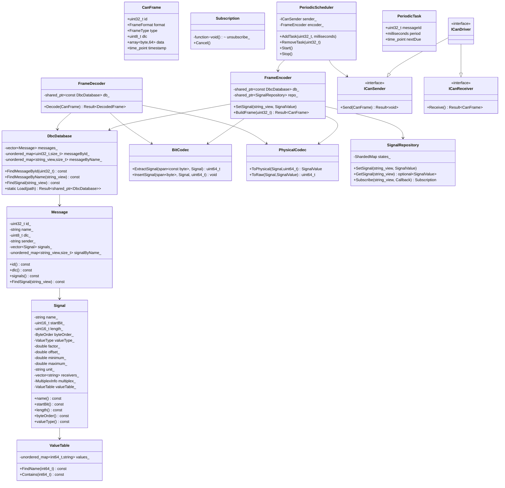

# CAN DBC 解析模块
## 1. 总体架构设计

### 1.1 分层架构

```text
+--------------------------------------------------+
| Application / Domain Logic                       |
| - 业务逻辑                                       |
| - 控制策略                                       |
| - UI / 上位机接口                                |
+-------------------------+------------------------+
                          |
                          v
+--------------------------------------------------+
| SignalRepository                                |
| - SetSignal / GetSignal / Subscribe             |
| - 线程安全信号状态                               |
| - Observer 通知                                  |
+-------------------------+------------------------+
                          |
                          v
+--------------------------------------------------+
| Encoder / Decoder                               |
| - FrameDecoder                                  |
| - FrameEncoder                                  |
| - BitCodec                                      |
| - Physical <-> Raw                              |
+-------------------------+------------------------+
                          |
                          v
+--------------------------------------------------+
| DBC Database                                     |
| - Message 元数据                                 |
| - Signal 元数据                                  |
| - ValueTable                                     |
| - Multiplex 规则                                 |
+-------------------------+------------------------+
                          |
                          v
+--------------------------------------------------+
| CAN Driver Abstraction                           |
| - ICanSender                                     |
| - ICanReceiver                                   |
| - Vector / Peak / Kvaser / ZLG / SocketCAN       |
+--------------------------------------------------+
```

### 1.2 关键设计思想

核心原则是：

```text
DBC Database：只描述“报文是什么”
BitCodec：只解决“位如何提取和插入”
Decoder：负责“CAN Frame -> SignalValue”
Encoder：负责“SignalValue -> CAN Frame”
SignalRepository：负责“运行时信号状态”
Scheduler：负责“什么时候发送”
Driver：负责“怎么发送到硬件”
```

这样可以避免一个巨大 `CanManager` 同时负责 DBC、状态、线程、驱动、调度和业务逻辑。

---

## 2. 模块划分

```text
can_dbc/
├── CMakeLists.txt
├── include/
│   └── can_dbc/
│       ├── core/
│       │   ├── CanFrame.hpp
│       │   ├── Error.hpp
│       │   ├── Types.hpp
│       │   └── Result.hpp
│       │
│       ├── dbc/
│       │   ├── DbcDatabase.hpp
│       │   ├── Message.hpp
│       │   ├── Signal.hpp
│       │   ├── ValueTable.hpp
│       │   ├── DbcLoader.hpp
│       │   ├── DbcLexer.hpp
│       │   ├── DbcParser.hpp
│       │   ├── DbcAst.hpp
│       │   └── SemanticAnalyzer.hpp
│       │
│       ├── codec/
│       │   ├── BitCodec.hpp
│       │   ├── PhysicalCodec.hpp
│       │   ├── FrameDecoder.hpp
│       │   └── FrameEncoder.hpp
│       │
│       ├── repository/
│       │   ├── SignalRepository.hpp
│       │   ├── Subscription.hpp
│       │   └── SignalSnapshot.hpp
│       │
│       ├── driver/
│       │   ├── ICanSender.hpp
│       │   ├── ICanReceiver.hpp
│       │   ├── ICanDriver.hpp
│       │   └── adapters/
│       │       ├── SocketCanDriver.hpp
│       │       ├── VectorCanDriver.hpp
│       │       ├── PeakCanDriver.hpp
│       │       ├── KvaserCanDriver.hpp
│       │       └── ZlgCanDriver.hpp
│       │
│       ├── scheduler/
│       │   ├── PeriodicTask.hpp
│       │   └── PeriodicScheduler.hpp
│       │
│       └── runtime/
│           ├── CanRuntime.hpp
│           ├── RxWorker.hpp
│           └── TxWorker.hpp
│
├── src/
│   ├── dbc/
│   ├── codec/
│   ├── repository/
│   ├── driver/
│   ├── scheduler/
│   └── runtime/
│
├── tests/
│   ├── unit/
│   │   ├── test_bit_codec.cpp
│   │   ├── test_physical_codec.cpp
│   │   ├── test_dbc_parser.cpp
│   │   ├── test_decoder.cpp
│   │   ├── test_encoder.cpp
│   │   └── test_repository.cpp
│   │
│   ├── integration/
│   │   ├── test_socketcan_loopback.cpp
│   │   └── test_dbc_roundtrip.cpp
│   │
│   └── regression/
│       └── dbc_samples/
│
└── examples/
    ├── decode_frame.cpp
    ├── encode_frame.cpp
    └── periodic_send.cpp
```

---

## 3. UML 类图



---

## 4. 核心类职责说明

|类 / 模块|为什么存在|为什么不放到别的类里|
|---|---|---|
|`CanFrame`|表示 CAN / CAN FD 原始帧|不能放到驱动里，否则编解码无法独立测试|
|`DbcDatabase`|保存不可变 DBC 元数据和索引|不负责解析和编解码，避免数据库对象过重|
|`Message`|表示 DBC 报文定义|不处理运行时状态，保持元数据纯净|
|`Signal`|表示 DBC 信号定义|不负责信号值存储，否则元数据和运行时状态耦合|
|`ValueTable`|表示枚举值映射|独立后可支持外部字典或国际化|
|`BitCodec`|处理位提取和位插入|独立纯算法，便于边界测试|
|`PhysicalCodec`|处理 Raw / Physical 映射|不放入 `BitCodec`，因为位操作和物理换算是两个变化轴|
|`FrameDecoder`|将 `CanFrame` 解码成信号值|不直接更新仓库，便于复用和测试|
|`FrameEncoder`|将信号值编码成 `CanFrame`|不直接调用驱动，避免和硬件耦合|
|`SignalRepository`|保存运行时信号状态和订阅关系|不包含业务逻辑，否则仓库会膨胀|
|`PeriodicScheduler`|管理周期任务|不负责编码细节和驱动适配|
|`ICanSender` / `ICanReceiver`|抽象 CAN 发送和接收|符合 ISP，发送者不必依赖接收接口|

---

## 5. 核心类型定义

> 说明：`std::expected` 是 C++23 标准库特性。如果项目必须严格 C++20，可以使用 `tl::expected` 或自定义 `Expected<T, E>` 适配层。

```cpp
#pragma once

#include <array>
#include <bit>
#include <byte>
#include <chrono>
#include <cstdint>
#include <expected>
#include <optional>
#include <span>
#include <string>
#include <string_view>
#include <unordered_map>
#include <variant>
#include <vector>

namespace can_dbc {

enum class ByteOrder {
    IntelLittleEndian,
    MotorolaBigEndian
};

enum class ValueType {
    Unsigned,
    Signed,
    Float32,
    Float64
};

enum class FrameFormat {
    Standard11Bit,
    Extended29Bit
};

enum class FrameType {
    Data,
    Remote,
    Error
};

enum class ErrorCode {
    Ok,
    FileNotFound,
    LexicalError,
    SyntaxError,
    SemanticError,
    MessageNotFound,
    SignalNotFound,
    InvalidFrameLength,
    InvalidSignalLength,
    PhysicalValueOutOfRange,
    DriverError,
    SchedulerStopped
};

struct Error {
    ErrorCode code {};
    std::string message;
};

template <typename T>
using Result = std::expected<T, Error>;

using SignalValue = std::variant<std::int64_t, std::uint64_t, double, std::string>;

struct CanFrame {
    std::uint32_t id {};
    FrameFormat format {FrameFormat::Standard11Bit};
    FrameType type {FrameType::Data};

    // 兼容 CAN FD，Classic CAN 只使用前 8 字节。
    std::uint8_t dlc {};
    std::array<std::byte, 64> data {};

    std::chrono::steady_clock::time_point timestamp {
        std::chrono::steady_clock::now()
    };
};

}
```

---

## 6. DBC 数据模型设计

### 6.1 Signal

```cpp
#pragma once

#include "can_dbc/core/Types.hpp"

namespace can_dbc {

enum class MultiplexKind {
    None,
    Multiplexor,
    Multiplexed
};

struct MultiplexInfo {
    MultiplexKind kind {MultiplexKind::None};

    // 对 m0、m1、m2 等复用信号有效。
    std::optional<std::int64_t> switchValue;
};

class ValueTable {
public:
    void Add(std::int64_t raw, std::string name) {
        values_.emplace(raw, std::move(name));
    }

    [[nodiscard]] std::optional<std::string_view>
    FindName(std::int64_t raw) const {
        if (auto it = values_.find(raw); it != values_.end()) {
            return it->second;
        }
        return std::nullopt;
    }

    [[nodiscard]] bool Contains(std::int64_t raw) const {
        return values_.contains(raw);
    }

private:
    std::unordered_map<std::int64_t, std::string> values_;
};

class Signal {
public:
    Signal(
        std::string name,
        std::uint16_t startBit,
        std::uint16_t length,
        ByteOrder byteOrder,
        ValueType valueType,
        double factor,
        double offset,
        double minimum,
        double maximum,
        std::string unit,
        std::vector<std::string> receivers,
        MultiplexInfo multiplex,
        ValueTable valueTable
    )
        : name_(std::move(name)),
          startBit_(startBit),
          length_(length),
          byteOrder_(byteOrder),
          valueType_(valueType),
          factor_(factor),
          offset_(offset),
          minimum_(minimum),
          maximum_(maximum),
          unit_(std::move(unit)),
          receivers_(std::move(receivers)),
          multiplex_(multiplex),
          valueTable_(std::move(valueTable)) {}

    [[nodiscard]] std::string_view name() const noexcept { return name_; }
    [[nodiscard]] std::uint16_t startBit() const noexcept { return startBit_; }
    [[nodiscard]] std::uint16_t length() const noexcept { return length_; }
    [[nodiscard]] ByteOrder byteOrder() const noexcept { return byteOrder_; }
    [[nodiscard]] ValueType valueType() const noexcept { return valueType_; }

    [[nodiscard]] double factor() const noexcept { return factor_; }
    [[nodiscard]] double offset() const noexcept { return offset_; }
    [[nodiscard]] double minimum() const noexcept { return minimum_; }
    [[nodiscard]] double maximum() const noexcept { return maximum_; }

    [[nodiscard]] std::string_view unit() const noexcept { return unit_; }
    [[nodiscard]] const std::vector<std::string>& receivers() const noexcept {
        return receivers_;
    }

    [[nodiscard]] const MultiplexInfo& multiplex() const noexcept {
        return multiplex_;
    }

    [[nodiscard]] const ValueTable& valueTable() const noexcept {
        return valueTable_;
    }

private:
    std::string name_;
    std::uint16_t startBit_ {};
    std::uint16_t length_ {};
    ByteOrder byteOrder_ {};
    ValueType valueType_ {};

    double factor_ {1.0};
    double offset_ {0.0};
    double minimum_ {};
    double maximum_ {};

    std::string unit_;
    std::vector<std::string> receivers_;
    MultiplexInfo multiplex_;
    ValueTable valueTable_;
};

}
```

### 6.2 Message

```cpp
#pragma once

#include "can_dbc/dbc/Signal.hpp"

namespace can_dbc {

class Message {
public:
    Message(
        std::uint32_t id,
        std::string name,
        std::uint8_t dlc,
        std::string sender,
        std::vector<Signal> signals,
        std::string comment = {}
    )
        : id_(id),
          name_(std::move(name)),
          dlc_(dlc),
          sender_(std::move(sender)),
          signals_(std::move(signals)),
          comment_(std::move(comment)) {
        BuildSignalIndex();
    }

    [[nodiscard]] std::uint32_t id() const noexcept { return id_; }
    [[nodiscard]] std::string_view name() const noexcept { return name_; }
    [[nodiscard]] std::uint8_t dlc() const noexcept { return dlc_; }
    [[nodiscard]] std::string_view sender() const noexcept { return sender_; }
    [[nodiscard]] std::string_view comment() const noexcept { return comment_; }

    [[nodiscard]] std::span<const Signal> signals() const noexcept {
        return signals_;
    }

    [[nodiscard]] const Signal* FindSignal(std::string_view name) const {
        if (auto it = signalByName_.find(name); it != signalByName_.end()) {
            return &signals_[it->second];
        }
        return nullptr;
    }

private:
    void BuildSignalIndex() {
        for (std::size_t i = 0; i < signals_.size(); ++i) {
            signalByName_.emplace(signals_[i].name(), i);
        }
    }

private:
    std::uint32_t id_ {};
    std::string name_;
    std::uint8_t dlc_ {};
    std::string sender_;
    std::vector<Signal> signals_;
    std::string comment_;

    std::unordered_map<std::string_view, std::size_t> signalByName_;
};

}
```

### 6.3 DbcDatabase

```cpp
#pragma once

#include "can_dbc/dbc/Message.hpp"

namespace can_dbc {

class DbcDatabase {
public:
    static Result<std::shared_ptr<const DbcDatabase>>
    Load(const std::filesystem::path& path);

    explicit DbcDatabase(std::vector<Message> messages)
        : messages_(std::move(messages)) {
        BuildIndexes();
    }

    [[nodiscard]] const Message* FindMessageById(std::uint32_t id) const {
        if (auto it = messageById_.find(id); it != messageById_.end()) {
            return &messages_[it->second];
        }
        return nullptr;
    }

    [[nodiscard]] const Message* FindMessageByName(std::string_view name) const {
        if (auto it = messageByName_.find(name); it != messageByName_.end()) {
            return &messages_[it->second];
        }
        return nullptr;
    }

    [[nodiscard]] const Signal* FindSignal(std::string_view signalName) const {
        if (auto it = signalByName_.find(signalName); it != signalByName_.end()) {
            const auto& [messageIndex, signalIndex] = it->second;
            return &messages_[messageIndex].signals()[signalIndex];
        }
        return nullptr;
    }

    [[nodiscard]] std::span<const Message> messages() const noexcept {
        return messages_;
    }

private:
    void BuildIndexes() {
        for (std::size_t mi = 0; mi < messages_.size(); ++mi) {
            const auto& msg = messages_[mi];
            messageById_.emplace(msg.id(), mi);
            messageByName_.emplace(msg.name(), mi);

            const auto signals = msg.signals();
            for (std::size_t si = 0; si < signals.size(); ++si) {
                signalByName_.emplace(signals[si].name(), std::pair{mi, si});
            }
        }
    }

private:
    std::vector<Message> messages_;
    std::unordered_map<std::uint32_t, std::size_t> messageById_;
    std::unordered_map<std::string_view, std::size_t> messageByName_;
    std::unordered_map<std::string_view, std::pair<std::size_t, std::size_t>> signalByName_;
};

}
```

`DbcDatabase` 加载完成后建议视为**不可变对象**，多线程只读访问，无需加锁。

---

## 7. DBC 解析流程

### 7.1 解析管线

```text
DBC File
   |
   v
FileReader
   |
   v
DbcLexer
   |
   v
Token Stream
   |
   v
DbcParser
   |
   v
DBC AST
   |
   v
SemanticAnalyzer
   |
   v
DatabaseBuilder
   |
   v
DbcDatabase
```

### 7.2 职责边界

|模块|职责|禁止承担|
|---|---|---|
|`FileReader`|文件读取、编码处理、行号维护|不解析 DBC 语法|
|`DbcLexer`|字符流转 Token|不理解 Message / Signal 语义|
|`DbcParser`|Token 转 AST|不做复杂语义校验|
|`SemanticAnalyzer`|校验 ID、DLC、信号位范围、重复信号、复用关系|不直接读取文件|
|`DatabaseBuilder`|AST 转不可变数据模型|不处理词法和语法细节|

### 7.3 需要支持的 DBC 语法元素

典型 DBC 片段：

```dbc
BU_: ECM TCU ABS

BO_ 291 VehicleStatus: 8 ECM
 SG_ VehicleSpeed : 0|16@1+ (0.01,0) [0|250] "km/h" ABS,TCU
 SG_ EngineSpeed  : 16|16@1+ (0.125,0) [0|8000] "rpm" TCU
 SG_ Gear         : 32|4@1+ (1,0) [0|15] "" TCU

CM_ SG_ 291 VehicleSpeed "Vehicle speed signal";
VAL_ 291 Gear 0 "P" 1 "R" 2 "N" 3 "D" 4 "Gear4" 5 "Gear5";
```

对应解析内容：

```text
BO_     -> Message
SG_     -> Signal
BU_     -> Nodes / Sender / Receiver
CM_     -> Comment
VAL_    -> ValueTable
@1 / @0 -> Intel / Motorola
+ / -   -> Unsigned / Signed
M       -> Multiplexor
m0/m1   -> Multiplexed Signal
```

---

## 8. 位提取算法：Signal 解码

### 8.1 DBC 位定义说明

DBC 中信号定义通常为：

```text
startBit | length @ byteOrder sign
```

例如：

```dbc
SG_ VehicleSpeed : 0|16@1+ (0.01,0) [0|250] "km/h" ABS
```

含义：

|字段|含义|
|---|---|
|`startBit`|信号起始位|
|`length`|信号位长度|
|`@1`|Intel Little Endian|
|`@0`|Motorola Big Endian|
|`+`|无符号|
|`-`|有符号|

#### Intel Little Endian

Intel 格式中：

```text
startBit 是信号最低有效位 LSB
后续位地址递增
raw bit i -> frame bit startBit + i
```

示意：

```text
Byte0: bit7 bit6 bit5 bit4 bit3 bit2 bit1 bit0
                         ^ startBit = 0 时从 bit0 开始
```

#### Motorola Big Endian

Motorola 格式中：

```text
startBit 是信号最高有效位 MSB
同一字节内位号递减
到达 bit0 后跳到下一字节 bit7
```

例如 `startBit = 7, length = 16`：

```text
frame bit 顺序：
7,6,5,4,3,2,1,0,15,14,13,12,11,10,9,8
```

### 8.2 符号扩展

DBC 有符号信号采用二进制补码。

例如长度为 12 bit：

```text
raw = 0b1000_0000_0000
sign bit = bit 11
扩展后为负数
```

### 8.3 BitCodec：纯函数实现

```cpp
#pragma once

#include "can_dbc/core/Types.hpp"
#include "can_dbc/dbc/Signal.hpp"

#include <cassert>
#include <limits>

namespace can_dbc {

class BitCodec final {
public:
    static Result<std::uint64_t>
    ExtractSignal(std::span<const std::byte> data, const Signal& signal) {
        if (signal.length() == 0 || signal.length() > 64) {
            return std::unexpected(Error{
                ErrorCode::InvalidSignalLength,
                "Signal length must be in range [1, 64]"
            });
        }

        const auto requiredBits = data.size() * 8;
        if (!ValidateRange(requiredBits, signal)) {
            return std::unexpected(Error{
                ErrorCode::InvalidFrameLength,
                "Signal bit range exceeds frame length"
            });
        }

        std::uint64_t raw = 0;

        if (signal.byteOrder() == ByteOrder::IntelLittleEndian) {
            for (std::uint16_t i = 0; i < signal.length(); ++i) {
                const auto frameBit = static_cast<std::uint16_t>(signal.startBit() + i);
                const auto bit = ReadBit(data, frameBit);
                raw |= static_cast<std::uint64_t>(bit) << i;
            }
        } else {
            std::uint16_t frameBit = signal.startBit();

            // k = 0 表示信号 MSB。
            for (std::uint16_t k = 0; k < signal.length(); ++k) {
                const auto bit = ReadBit(data, frameBit);
                const auto rawBitIndex = static_cast<std::uint16_t>(signal.length() - 1 - k);
                raw |= static_cast<std::uint64_t>(bit) << rawBitIndex;

                frameBit = NextMotorolaBit(frameBit);
            }
        }

        return raw;
    }

    static Result<void>
    InsertSignal(
        std::span<std::byte> data,
        const Signal& signal,
        std::uint64_t raw
    ) {
        if (signal.length() == 0 || signal.length() > 64) {
            return std::unexpected(Error{
                ErrorCode::InvalidSignalLength,
                "Signal length must be in range [1, 64]"
            });
        }

        const auto requiredBits = data.size() * 8;
        if (!ValidateRange(requiredBits, signal)) {
            return std::unexpected(Error{
                ErrorCode::InvalidFrameLength,
                "Signal bit range exceeds frame length"
            });
        }

        raw &= Mask(signal.length());

        if (signal.byteOrder() == ByteOrder::IntelLittleEndian) {
            for (std::uint16_t i = 0; i < signal.length(); ++i) {
                const auto frameBit = static_cast<std::uint16_t>(signal.startBit() + i);
                const bool bit = ((raw >> i) & 0x1U) != 0;
                WriteBit(data, frameBit, bit);
            }
        } else {
            std::uint16_t frameBit = signal.startBit();

            for (std::uint16_t k = 0; k < signal.length(); ++k) {
                const auto rawBitIndex = static_cast<std::uint16_t>(signal.length() - 1 - k);
                const bool bit = ((raw >> rawBitIndex) & 0x1U) != 0;
                WriteBit(data, frameBit, bit);

                frameBit = NextMotorolaBit(frameBit);
            }
        }

        return {};
    }

    static std::int64_t SignExtend(std::uint64_t raw, std::uint16_t length) {
        assert(length >= 1 && length <= 64);

        if (length == 64) {
            return std::bit_cast<std::int64_t>(raw);
        }

        const std::uint64_t signBit = 1ULL << (length - 1);
        const std::uint64_t mask = Mask(length);

        raw &= mask;

        if ((raw & signBit) == 0) {
            return static_cast<std::int64_t>(raw);
        }

        const std::uint64_t extended = raw | ~mask;
        return std::bit_cast<std::int64_t>(extended);
    }

    static constexpr std::uint64_t Mask(std::uint16_t length) {
        if (length == 64) {
            return std::numeric_limits<std::uint64_t>::max();
        }
        return (1ULL << length) - 1ULL;
    }

private:
    static bool ReadBit(std::span<const std::byte> data, std::uint16_t bitIndex) {
        const auto byteIndex = bitIndex / 8;
        const auto bitInByte = bitIndex % 8;

        const auto value = std::to_integer<std::uint8_t>(data[byteIndex]);
        return ((value >> bitInByte) & 0x1U) != 0;
    }

    static void WriteBit(
        std::span<std::byte> data,
        std::uint16_t bitIndex,
        bool bit
    ) {
        const auto byteIndex = bitIndex / 8;
        const auto bitInByte = bitIndex % 8;

        auto value = std::to_integer<std::uint8_t>(data[byteIndex]);

        if (bit) {
            value |= static_cast<std::uint8_t>(1U << bitInByte);
        } else {
            value &= static_cast<std::uint8_t>(~(1U << bitInByte));
        }

        data[byteIndex] = static_cast<std::byte>(value);
    }

    static constexpr std::uint16_t NextMotorolaBit(std::uint16_t current) {
        // DBC Motorola:
        // 同一字节内 bit index 递减。
        // 到 bit0 后，下一个信号位跳到下一字节 bit7。
        if ((current % 8U) == 0U) {
            return static_cast<std::uint16_t>(current + 15U);
        }

        return static_cast<std::uint16_t>(current - 1U);
    }

    static bool ValidateRange(std::size_t totalBits, const Signal& signal) {
        if (signal.byteOrder() == ByteOrder::IntelLittleEndian) {
            return static_cast<std::size_t>(signal.startBit()) + signal.length()
                   <= totalBits;
        }

        std::uint16_t bit = signal.startBit();

        for (std::uint16_t i = 0; i < signal.length(); ++i) {
            if (bit >= totalBits) {
                return false;
            }
            bit = NextMotorolaBit(bit);
        }

        return true;
    }
};

}
```

#### 为什么该算法可测试？

`BitCodec`：

```text
无状态
无 I/O
无数据库依赖
无驱动依赖
输入相同，输出必定相同
```

因此可以针对以下场景做单元测试：

```text
Intel 1 bit / 8 bit / 16 bit / 64 bit
Motorola 1 bit / 跨字节 / 64 bit
有符号正数
有符号负数
边界 bit0 / bit7 / bit63
非法 length
非法 frame range
```

---

## 9. Physical / Raw 映射

### 9.1 解码公式

```text
physical = raw * factor + offset
```

对于有符号信号：

```text
signedRaw = SignExtend(raw, length)
physical = signedRaw * factor + offset
```

### 9.2 编码公式

```text
raw = round((physical - offset) / factor)
```

### 9.3 PhysicalCodec

```cpp
#pragma once

#include "can_dbc/codec/BitCodec.hpp"

#include <cmath>

namespace can_dbc {

class PhysicalCodec final {
public:
    static Result<SignalValue>
    ToPhysical(const Signal& signal, std::uint64_t raw) {
        switch (signal.valueType()) {
        case ValueType::Unsigned: {
            const double physical =
                static_cast<double>(raw) * signal.factor() + signal.offset();
            return physical;
        }

        case ValueType::Signed: {
            const auto signedRaw = BitCodec::SignExtend(raw, signal.length());
            const double physical =
                static_cast<double>(signedRaw) * signal.factor() + signal.offset();
            return physical;
        }

        case ValueType::Float32:
        case ValueType::Float64:
            return std::unexpected(Error{
                ErrorCode::SemanticError,
                "Float signal physical decoding should use explicit float codec"
            });
        }

        return std::unexpected(Error{
            ErrorCode::SemanticError,
            "Unsupported value type"
        });
    }

    static Result<std::uint64_t>
    ToRaw(const Signal& signal, SignalValue value) {
        const double physical = ToDouble(value);

        if (physical < signal.minimum() || physical > signal.maximum()) {
            return std::unexpected(Error{
                ErrorCode::PhysicalValueOutOfRange,
                "Physical value out of DBC range"
            });
        }

        const double rawDouble =
            (physical - signal.offset()) / signal.factor();

        const auto rounded = std::llround(rawDouble);

        if (signal.valueType() == ValueType::Signed) {
            const auto minRaw = -(1LL << (signal.length() - 1));
            const auto maxRaw =  (1LL << (signal.length() - 1)) - 1;

            if (rounded < minRaw || rounded > maxRaw) {
                return std::unexpected(Error{
                    ErrorCode::PhysicalValueOutOfRange,
                    "Signed raw value out of range"
                });
            }

            return static_cast<std::uint64_t>(rounded) &
                   BitCodec::Mask(signal.length());
        }

        const auto maxRaw = BitCodec::Mask(signal.length());

        if (rounded < 0 || static_cast<std::uint64_t>(rounded) > maxRaw) {
            return std::unexpected(Error{
                ErrorCode::PhysicalValueOutOfRange,
                "Unsigned raw value out of range"
            });
        }

        return static_cast<std::uint64_t>(rounded);
    }

private:
    static double ToDouble(const SignalValue& value) {
        return std::visit([](const auto& v) -> double {
            using T = std::decay_t<decltype(v)>;

            if constexpr (std::is_same_v<T, double>) {
                return v;
            } else if constexpr (std::is_same_v<T, std::int64_t>) {
                return static_cast<double>(v);
            } else if constexpr (std::is_same_v<T, std::uint64_t>) {
                return static_cast<double>(v);
            } else {
                throw std::invalid_argument("Cannot convert string SignalValue to double");
            }
        }, value);
    }
};

}
```

生产环境建议不要在 `ToDouble` 中抛异常，而是返回 `Result<double>`，上面为了突出核心逻辑做了简化。

---

## 10. CAN 接收解析设计

### 10.1 调用方式

```cpp
CanFrame frame;
frame.id = 0x123;
frame.dlc = 8;
frame.data = {
    std::byte{0x11}, std::byte{0x22}, std::byte{0x33}, std::byte{0x44},
    std::byte{0x55}, std::byte{0x66}, std::byte{0x77}, std::byte{0x88}
};

auto result = decoder.Decode(frame);
```

输出逻辑结构：

```json
{
    "VehicleSpeed" : 82.5,
    "EngineSpeed"  : 2500,
    "Gear"         : 4
}
```

### 10.2 DecodedFrame

```cpp
#pragma once

#include "can_dbc/core/Types.hpp"

namespace can_dbc {

struct DecodedSignal {
    std::string_view name;
    SignalValue value;
    std::optional<std::string_view> enumName;
};

struct DecodedFrame {
    std::uint32_t messageId {};
    std::string_view messageName;
    std::vector<DecodedSignal> signals;
};

}
```

### 10.3 FrameDecoder

```cpp
#pragma once

#include "can_dbc/codec/BitCodec.hpp"
#include "can_dbc/codec/PhysicalCodec.hpp"
#include "can_dbc/dbc/DbcDatabase.hpp"

namespace can_dbc {

class FrameDecoder final {
public:
    explicit FrameDecoder(std::shared_ptr<const DbcDatabase> db)
        : db_(std::move(db)) {}

    Result<DecodedFrame> Decode(const CanFrame& frame) const {
        const auto* message = db_->FindMessageById(frame.id);
        if (message == nullptr) {
            return std::unexpected(Error{
                ErrorCode::MessageNotFound,
                "Message id not found in DBC"
            });
        }

        if (frame.dlc < message->dlc()) {
            return std::unexpected(Error{
                ErrorCode::InvalidFrameLength,
                "Frame DLC smaller than DBC message DLC"
            });
        }

        DecodedFrame decoded;
        decoded.messageId = message->id();
        decoded.messageName = message->name();

        std::optional<std::int64_t> muxValue;

        // 第一遍：找到 Multiplexor。
        for (const auto& signal : message->signals()) {
            if (signal.multiplex().kind != MultiplexKind::Multiplexor) {
                continue;
            }

            auto raw = BitCodec::ExtractSignal(
                std::span<const std::byte>{frame.data.data(), message->dlc()},
                signal
            );

            if (!raw) {
                return std::unexpected(raw.error());
            }

            muxValue = static_cast<std::int64_t>(*raw);
            break;
        }

        for (const auto& signal : message->signals()) {
            if (!IsSignalActive(signal, muxValue)) {
                continue;
            }

            auto raw = BitCodec::ExtractSignal(
                std::span<const std::byte>{frame.data.data(), message->dlc()},
                signal
            );

            if (!raw) {
                return std::unexpected(raw.error());
            }

            auto physical = PhysicalCodec::ToPhysical(signal, *raw);
            if (!physical) {
                return std::unexpected(physical.error());
            }

            std::optional<std::string_view> enumName;

            if (auto name = signal.valueTable().FindName(static_cast<std::int64_t>(*raw))) {
                enumName = *name;
            }

            decoded.signals.push_back(DecodedSignal{
                .name = signal.name(),
                .value = *physical,
                .enumName = enumName
            });
        }

        return decoded;
    }

private:
    static bool IsSignalActive(
        const Signal& signal,
        std::optional<std::int64_t> muxValue
    ) {
        const auto& mux = signal.multiplex();

        if (mux.kind == MultiplexKind::None ||
            mux.kind == MultiplexKind::Multiplexor) {
            return true;
        }

        if (mux.kind == MultiplexKind::Multiplexed) {
            return muxValue.has_value() &&
                   mux.switchValue.has_value() &&
                   *muxValue == *mux.switchValue;
        }

        return false;
    }

private:
    std::shared_ptr<const DbcDatabase> db_;
};

}
```

---

## 11. Signal 编码发送设计

### 11.1 使用方式

```cpp
encoder.SetSignal("VehicleSpeed", 120.5);
encoder.SetSignal("Gear", 5.0);

auto frame = encoder.BuildFrame(0x123);
```

内部流程：

```text
Physical Value
      |
      v
Raw Value
      |
      v
Bit Packing
      |
      v
CAN Frame
```

### 11.2 编码器依赖关系

```text
FrameEncoder
   |
   +-- DbcDatabase          只读元数据
   |
   +-- SignalRepository     读取运行时信号值
   |
   +-- BitCodec             位插入纯算法
   |
   +-- PhysicalCodec        物理值转 Raw
```

`FrameEncoder` **不依赖 CAN Driver**。

发送动作由更上层的 `PeriodicScheduler` 或应用层完成：

```text
FrameEncoder.BuildFrame()
        |
        v
ICanSender.Send()
```

这样做可以避免编码器和硬件驱动耦合过深。

### 11.3 FrameEncoder

```cpp
#pragma once

#include "can_dbc/codec/BitCodec.hpp"
#include "can_dbc/codec/PhysicalCodec.hpp"
#include "can_dbc/dbc/DbcDatabase.hpp"
#include "can_dbc/repository/SignalRepository.hpp"

namespace can_dbc {

class FrameEncoder final {
public:
    FrameEncoder(
        std::shared_ptr<const DbcDatabase> db,
        std::shared_ptr<SignalRepository> repository
    )
        : db_(std::move(db)),
          repository_(std::move(repository)) {}

    Result<void> SetSignal(std::string_view name, SignalValue value) {
        const auto* signal = db_->FindSignal(name);
        if (signal == nullptr) {
            return std::unexpected(Error{
                ErrorCode::SignalNotFound,
                "Signal not found in DBC"
            });
        }

        repository_->SetSignal(name, std::move(value));
        return {};
    }

    Result<CanFrame> BuildFrame(std::uint32_t messageId) const {
        const auto* message = db_->FindMessageById(messageId);
        if (message == nullptr) {
            return std::unexpected(Error{
                ErrorCode::MessageNotFound,
                "Message id not found in DBC"
            });
        }

        CanFrame frame;
        frame.id = message->id();
        frame.dlc = message->dlc();

        std::span<std::byte> payload {
            frame.data.data(),
            static_cast<std::size_t>(frame.dlc)
        };

        for (auto& b : payload) {
            b = std::byte{0};
        }

        for (const auto& signal : message->signals()) {
            auto value = repository_->GetSignal(signal.name());

            if (!value) {
                // 生产环境可配置默认值：
                // 1. 使用 DBC InitialValue
                // 2. 使用上一次发送值
                // 3. 使用 0
                value = 0.0;
            }

            auto raw = PhysicalCodec::ToRaw(signal, *value);
            if (!raw) {
                return std::unexpected(raw.error());
            }

            auto inserted = BitCodec::InsertSignal(payload, signal, *raw);
            if (!inserted) {
                return std::unexpected(inserted.error());
            }
        }

        return frame;
    }

private:
    std::shared_ptr<const DbcDatabase> db_;
    std::shared_ptr<SignalRepository> repository_;
};

}
```

---

## 12. SignalRepository 设计

### 12.1 API

```cpp
repo.SetSignal("VehicleSpeed", 82.5);

auto value = repo.GetSignal("VehicleSpeed");

auto sub = repo.Subscribe(
    "VehicleSpeed",
    [](const SignalValue& value) {
        // 业务回调
    }
);
```

### 12.2 设计目标

```text
线程安全
低锁竞争
Observer 模式
不包含业务逻辑
回调不在锁内执行
支持订阅取消
```

### 12.3 实现方案：分片 shared_mutex

```cpp
#pragma once

#include "can_dbc/core/Types.hpp"

#include <functional>
#include <mutex>
#include <shared_mutex>

namespace can_dbc {

using SignalCallback = std::function<void(const SignalValue&)>;

class Subscription final {
public:
    Subscription() = default;

    explicit Subscription(std::function<void()> unsubscribe)
        : unsubscribe_(std::move(unsubscribe)) {}

    Subscription(const Subscription&) = delete;
    Subscription& operator=(const Subscription&) = delete;

    Subscription(Subscription&& other) noexcept
        : unsubscribe_(std::move(other.unsubscribe_)) {
        other.unsubscribe_ = {};
    }

    Subscription& operator=(Subscription&& other) noexcept {
        if (this != &other) {
            Cancel();
            unsubscribe_ = std::move(other.unsubscribe_);
            other.unsubscribe_ = {};
        }
        return *this;
    }

    ~Subscription() {
        Cancel();
    }

    void Cancel() {
        if (unsubscribe_) {
            unsubscribe_();
            unsubscribe_ = {};
        }
    }

private:
    std::function<void()> unsubscribe_;
};

class SignalRepository final {
public:
    void SetSignal(std::string_view name, SignalValue value) {
        std::vector<SignalCallback> callbacks;

        {
            auto& shard = GetShard(name);
            std::unique_lock lock(shard.mutex);

            auto& state = shard.states[std::string{name}];
            state.value = value;

            for (auto& [id, callback] : state.callbacks) {
                callbacks.push_back(callback);
            }
        }

        // 回调必须在锁外执行，避免死锁和长时间持锁。
        for (auto& callback : callbacks) {
            callback(value);
        }
    }

    std::optional<SignalValue> GetSignal(std::string_view name) const {
        const auto& shard = GetShard(name);
        std::shared_lock lock(shard.mutex);

        if (auto it = shard.states.find(std::string{name}); it != shard.states.end()) {
            return it->second.value;
        }

        return std::nullopt;
    }

    Subscription Subscribe(std::string_view name, SignalCallback callback) {
        const auto id = NextCallbackId();

        {
            auto& shard = GetShard(name);
            std::unique_lock lock(shard.mutex);

            auto& state = shard.states[std::string{name}];
            state.callbacks.emplace(id, std::move(callback));
        }

        const std::string key{name};

        return Subscription{
            [this, key, id] {
                auto& shard = GetShard(key);
                std::unique_lock lock(shard.mutex);

                if (auto it = shard.states.find(key); it != shard.states.end()) {
                    it->second.callbacks.erase(id);
                }
            }
        };
    }

private:
    struct SignalState {
        SignalValue value {};
        std::unordered_map<std::uint64_t, SignalCallback> callbacks;
    };

    struct Shard {
        mutable std::shared_mutex mutex;
        std::unordered_map<std::string, SignalState> states;
    };

    static constexpr std::size_t ShardCount = 64;

    Shard& GetShard(std::string_view name) {
        const auto index = std::hash<std::string_view>{}(name) % ShardCount;
        return shards_[index];
    }

    const Shard& GetShard(std::string_view name) const {
        const auto index = std::hash<std::string_view>{}(name) % ShardCount;
        return shards_[index];
    }

    std::uint64_t NextCallbackId() {
        return callbackId_.fetch_add(1, std::memory_order_relaxed);
    }

private:
    std::array<Shard, ShardCount> shards_;
    std::atomic<std::uint64_t> callbackId_ {1};
};

}
```

### 12.4 mutex / shared_mutex / lock-free 对比

|方案|可维护性|复杂度|性能|测试难度|适用场景|
|---|--:|--:|--:|--:|---|
|单 `mutex`|高|低|中低|低|信号数量少、频率不高|
|`shared_mutex`|高|中|中高|中|读多写少，工程推荐|
|分片 `shared_mutex`|中高|中|高|中|多线程高频读写|
|lock-free|低|高|最高|高|极端实时、高频、固定内存模型|

推荐生产默认方案：

```text
分片 shared_mutex + 回调锁外执行
```

原因：

```text
性能足够
测试成本可控
代码可维护
容易排查问题
```

lock-free 可以用于接收线程到解码线程之间的 `SPSC RingBuffer`，但不建议一开始就把整个仓库做成 lock-free。

---

## 13. 周期报文发送设计

### 13.1 使用方式

```cpp
using namespace std::chrono_literals;

scheduler.AddTask(0x123, 10ms);
scheduler.Start();
```

发送流程：

```text
PeriodicTask 到期
      |
      v
FrameEncoder.BuildFrame(messageId)
      |
      v
ICanSender.Send(frame)
```

### 13.2 任务对象

```cpp
#pragma once

#include <chrono>
#include <cstdint>

namespace can_dbc {

struct PeriodicTask {
    std::uint32_t messageId {};
    std::chrono::milliseconds period {};
    std::chrono::steady_clock::time_point nextDue {};
    bool enabled {true};
};

}
```

### 13.3 调度器

```cpp
#pragma once

#include "can_dbc/codec/FrameEncoder.hpp"
#include "can_dbc/driver/ICanSender.hpp"
#include "can_dbc/scheduler/PeriodicTask.hpp"

#include <condition_variable>
#include <thread>

namespace can_dbc {

class PeriodicScheduler final {
public:
    PeriodicScheduler(
        FrameEncoder& encoder,
        ICanSender& sender
    )
        : encoder_(encoder),
          sender_(sender) {}

    ~PeriodicScheduler() {
        Stop();
    }

    void AddTask(std::uint32_t messageId, std::chrono::milliseconds period) {
        std::lock_guard lock(mutex_);

        tasks_[messageId] = PeriodicTask{
            .messageId = messageId,
            .period = period,
            .nextDue = std::chrono::steady_clock::now() + period,
            .enabled = true
        };

        cv_.notify_one();
    }

    void RemoveTask(std::uint32_t messageId) {
        std::lock_guard lock(mutex_);
        tasks_.erase(messageId);
        cv_.notify_one();
    }

    void Start() {
        std::lock_guard lock(mutex_);

        if (running_) {
            return;
        }

        running_ = true;
        worker_ = std::thread([this] {
            RunLoop();
        });
    }

    void Stop() {
        {
            std::lock_guard lock(mutex_);

            if (!running_) {
                return;
            }

            running_ = false;
        }

        cv_.notify_one();

        if (worker_.joinable()) {
            worker_.join();
        }
    }

private:
    void RunLoop() {
        std::unique_lock lock(mutex_);

        while (running_) {
            if (tasks_.empty()) {
                cv_.wait(lock, [this] {
                    return !running_ || !tasks_.empty();
                });
                continue;
            }

            const auto nextDue = FindNextDueLocked();

            cv_.wait_until(lock, nextDue, [this] {
                return !running_;
            });

            if (!running_) {
                break;
            }

            const auto now = std::chrono::steady_clock::now();

            std::vector<std::uint32_t> dueMessages;

            for (auto& [id, task] : tasks_) {
                if (task.enabled && task.nextDue <= now) {
                    dueMessages.push_back(id);
                    task.nextDue += task.period;
                }
            }

            // 编码和发送不在 scheduler 锁内执行。
            lock.unlock();

            for (const auto id : dueMessages) {
                auto frame = encoder_.BuildFrame(id);
                if (frame) {
                    static_cast<void>(sender_.Send(*frame));
                }
            }

            lock.lock();
        }
    }

    std::chrono::steady_clock::time_point FindNextDueLocked() const {
        auto next = std::chrono::steady_clock::time_point::max();

        for (const auto& [id, task] : tasks_) {
            if (task.enabled && task.nextDue < next) {
                next = task.nextDue;
            }
        }

        return next;
    }

private:
    FrameEncoder& encoder_;
    ICanSender& sender_;

    mutable std::mutex mutex_;
    std::condition_variable cv_;
    std::unordered_map<std::uint32_t, PeriodicTask> tasks_;

    bool running_ {false};
    std::thread worker_;
};

}
```

### 13.4 精度说明

毫秒级周期发送可以使用：

```text
std::chrono::steady_clock
std::condition_variable::wait_until
独立高优先级线程
```

在 Linux 实时场景中可以进一步优化：

```text
SCHED_FIFO / SCHED_RR
timerfd
clock_nanosleep
CPU affinity
mlockall
SocketCAN TX queue 参数调优
```

---

## 14. CAN 驱动抽象层

### 14.1 接口隔离设计

用户给出的接口是：

```cpp
class ICanDriver
{
public:
    virtual bool Send(const CanFrame&) = 0;
    virtual bool Receive(CanFrame&) = 0;
};
```

生产设计中建议拆成：

```cpp
#pragma once

#include "can_dbc/core/CanFrame.hpp"

namespace can_dbc {

class ICanSender {
public:
    virtual ~ICanSender() = default;
    virtual Result<void> Send(const CanFrame& frame) = 0;
};

class ICanReceiver {
public:
    virtual ~ICanReceiver() = default;
    virtual Result<CanFrame> Receive() = 0;
};

class ICanDriver : public ICanSender, public ICanReceiver {
public:
    ~ICanDriver() override = default;
};

}
```

好处：

```text
周期发送器只依赖 ICanSender
接收线程只依赖 ICanReceiver
测试时可以分别 Mock
符合 ISP 和 DIP
```

### 14.2 Adapter Pattern

```cpp
class SocketCanDriver final : public ICanDriver {
public:
    explicit SocketCanDriver(std::string interfaceName);
    ~SocketCanDriver() override;

    Result<void> Send(const CanFrame& frame) override;
    Result<CanFrame> Receive() override;

private:
    int fd_ {-1};
};
```

其他驱动：

```text
VectorCanDriver
PeakCanDriver
KvaserCanDriver
ZlgCanDriver
UsbCanDriver
```

都实现同一组接口。

### 14.3 优缺点

优点：

```text
上层不依赖厂商 SDK
新增驱动无需修改 Encoder / Decoder / Repository
便于 Mock 测试
支持运行时切换驱动
```

代价：

```text
抽象层需要统一不同厂商的错误码
高级特性可能需要扩展接口
部分驱动 API 语义不同，需要 Adapter 做额外转换
```

对于高级能力，可以用额外小接口扩展，而不是污染基础接口：

```cpp
class ICanFilterConfigurable {
public:
    virtual ~ICanFilterConfigurable() = default;
    virtual Result<void> SetFilter(std::span<const CanFilter> filters) = 0;
};

class ICanBusStatistics {
public:
    virtual ~ICanBusStatistics() = default;
    virtual CanBusStats GetStats() const = 0;
};
```

---

## 15. 接收线程模型

### 15.1 推荐线程模型

```text
+------------------+
| Driver RX Thread |
+------------------+
          |
          v
+------------------+
| SPSC RingBuffer  |
+------------------+
          |
          v
+------------------+
| Decode Thread    |
+------------------+
          |
          v
+------------------+
| SignalRepository |
+------------------+
          |
          v
+------------------+
| Subscribers      |
+------------------+
```

### 15.2 简化版本

低复杂度版本：

```text
RX Thread:
    frame = driver.Receive()
    decoded = decoder.Decode(frame)
    for signal in decoded:
        repo.SetSignal(signal.name, signal.value)
```

高性能版本：

```text
RX Thread:
    Receive frame
    Push to lock-free SPSC queue

Decode Thread:
    Pop frame
    Decode
    Update repository
```

### 15.3 RxWorker 示例

```cpp
class RxWorker final {
public:
    RxWorker(
        ICanReceiver& receiver,
        FrameDecoder& decoder,
        SignalRepository& repository
    )
        : receiver_(receiver),
          decoder_(decoder),
          repository_(repository) {}

    ~RxWorker() {
        Stop();
    }

    void Start() {
        running_.store(true, std::memory_order_release);

        worker_ = std::thread([this] {
            while (running_.load(std::memory_order_acquire)) {
                auto frame = receiver_.Receive();
                if (!frame) {
                    continue;
                }

                auto decoded = decoder_.Decode(*frame);
                if (!decoded) {
                    continue;
                }

                for (const auto& signal : decoded->signals) {
                    repository_.SetSignal(signal.name, signal.value);
                }
            }
        });
    }

    void Stop() {
        running_.store(false, std::memory_order_release);

        if (worker_.joinable()) {
            worker_.join();
        }
    }

private:
    ICanReceiver& receiver_;
    FrameDecoder& decoder_;
    SignalRepository& repository_;

    std::atomic_bool running_ {false};
    std::thread worker_;
};
```

生产环境中，`Receive()` 应支持超时或可中断，否则 `Stop()` 可能无法及时退出。

---

## 16. 架构数据流、控制流、生命周期

### 16.1 数据流

#### 接收方向

```text
CAN Bus
  |
  v
ICanReceiver.Receive()
  |
  v
CanFrame
  |
  v
FrameDecoder.Decode()
  |
  v
DecodedFrame
  |
  v
SignalRepository.SetSignal()
  |
  v
Subscribers / Application
```

#### 发送方向

```text
Application
  |
  v
SignalRepository.SetSignal()
  |
  v
FrameEncoder.BuildFrame(messageId)
  |
  v
CanFrame
  |
  v
ICanSender.Send()
  |
  v
CAN Bus
```

### 16.2 控制流

```text
Application 初始化：
1. 加载 DBC
2. 创建 Repository
3. 创建 Encoder / Decoder
4. 创建 CAN Driver
5. 创建 RxWorker
6. 创建 PeriodicScheduler
7. 启动 RX
8. 启动周期发送
```

### 16.3 生命周期

```cpp
auto db = DbcDatabase::Load("vehicle.dbc").value();

auto repository = std::make_shared<SignalRepository>();

FrameDecoder decoder{db};
FrameEncoder encoder{db, repository};

SocketCanDriver driver{"can0"};

RxWorker rx{driver, decoder, *repository};
PeriodicScheduler scheduler{encoder, driver};

rx.Start();
scheduler.AddTask(0x123, 10ms);
scheduler.Start();
```

销毁顺序建议：

```text
停止 Scheduler
停止 RxWorker
关闭 Driver
释放 Encoder / Decoder
释放 Repository
释放 DbcDatabase
```

---

## 17. 性能优化设计

目标：

```text
DBC 加载 < 500ms
单帧解析 < 5μs
单帧编码 < 5μs
支持 10000 frame/s
```

### 17.1 内存优化

#### `std::string_view`

用于索引查询：

```text
Message.name()
Signal.name()
unit()
sender()
```

注意：`string_view` 必须指向 `DbcDatabase` 内部稳定存储，不能指向临时字符串。

#### PMR

大 DBC 可使用：

```cpp
std::pmr::vector
std::pmr::string
std::pmr::unordered_map
```

优势：

```text
减少小对象频繁分配
提高 DBC 加载速度
便于统一内存统计
```

#### 对象池

适合：

```text
DecodedFrame
DecodedSignal vector buffer
Rx frame queue
Tx task object
```

不建议过早池化所有对象，容易降低可维护性。

### 17.2 解析优化

#### Message 索引

```cpp
std::unordered_map<std::uint32_t, std::size_t> messageById_;
```

使接收解码时：

```text
frame.id -> Message
```

达到平均 O(1)。

#### Signal 索引

```cpp
std::unordered_map<std::string_view, std::pair<size_t, size_t>> signalByName_;
```

使：

```cpp
encoder.SetSignal("VehicleSpeed", 120.5);
```

无需遍历所有 Message。

#### 预编译 Signal Layout

可以在 `DbcDatabase` 构建时，把每个 Signal 的位访问路径预计算出来：

```cpp
struct CompiledSignalLayout {
    std::array<std::uint16_t, 64> frameBits;
    std::array<std::uint8_t, 64> rawBits;
    std::uint8_t length;
};
```

这样解码时不用重复计算 Motorola 跳位。

### 17.3 并发优化

推荐组合：

```text
RX Thread -> SPSC RingBuffer -> Decode Thread
TX Scheduler Thread -> Driver Send
Application Thread -> Repository
```

#### RingBuffer

适合高频接收：

```text
固定容量
无动态内存
单生产者单消费者
延迟可控
```

#### Producer / Consumer

当解析负载较高时：

```text
一个 RX 线程
多个 Decode Worker
一个 Repository 汇聚层
```

但注意同一 Message ID 的顺序要求。如果业务依赖顺序，应按 Message ID 分片。

---

## 18. 关键测试策略

### 18.1 单元测试

|模块|测试内容|
|---|---|
|`BitCodec`|Intel / Motorola，跨字节，有符号，边界位|
|`PhysicalCodec`|factor / offset / min / max / signed|
|`DbcLexer`|Token 识别，字符串，注释|
|`DbcParser`|BO_ / SG_ / CM_ / VAL_ / Multiplex|
|`SemanticAnalyzer`|重复信号，越界信号，DLC 校验|
|`FrameDecoder`|Frame -> SignalValue|
|`FrameEncoder`|SignalValue -> Frame|
|`SignalRepository`|并发 Set / Get / Subscribe|
|`Scheduler`|周期精度，动态增删任务|

### 18.2 Round-trip 测试

```text
Physical Value
  -> Encode
  -> CanFrame
  -> Decode
  -> Physical Value
```

允许因为 `factor` 和四舍五入存在微小误差：

```cpp
EXPECT_NEAR(decodedSpeed, originalSpeed, 0.01);
```

### 18.3 回归测试

维护一组真实 DBC：

```text
classic_can.dbc
can_fd.dbc
multiplex.dbc
motorola.dbc
signed_signal.dbc
value_table.dbc
```

每次修改解析器和位算法都跑回归测试。

---

## 19. 生产环境优化建议

### 19.1 错误处理

不要用 `bool` 表示复杂错误。

建议：

```cpp
Result<void> Send(const CanFrame&);
Result<CanFrame> Receive();
Result<DecodedFrame> Decode(const CanFrame&);
```

错误中包含：

```text
错误码
错误消息
DBC 行号
Message ID
Signal Name
底层驱动错误码
```

### 19.2 日志

建议分级：

```text
TRACE: 每帧收发，默认关闭
DEBUG: 解码失败详情
INFO : 驱动打开、任务启动
WARN : 丢帧、超时、非法信号
ERROR: 驱动断开、DBC 加载失败
```

### 19.3 实时性

```text
避免热路径动态分配
避免在 RX 线程执行业务回调
避免在锁内调用用户代码
避免频繁 string 拷贝
预构建 Message / Signal 索引
预计算 Signal Layout
```

### 19.4 安全性

```text
所有 DLC 必须校验
所有 signal length 必须校验
所有 physical range 必须校验
所有 raw range 必须校验
所有 driver API 返回值必须检查
```

### 19.5 可扩展方向

|能力|扩展方式|
|---|---|
|CAN FD|`CanFrame` 已支持 64 字节，Message 增加 `isCanFd`|
|J1939|新增 `J1939IdCodec`，不修改 `BitCodec`|
|UDS|独立 `diagnostic` 模块，依赖 `ICanSender/Receiver`|
|SecOC|新增发送装饰器和接收验证器|
|Signal 编码规则扩展|新增 `IPhysicalCodecStrategy`|
|厂商驱动|新增 Adapter 实现|

---

## 20. 每个模块落实的设计原则

|模块|SRP|OCP|LSP|ISP|DIP|组合优于继承|
|---|---|---|---|---|---|---|
|`DbcLexer`|只做词法分析|可扩展 Token|不涉及|小接口|Parser 依赖抽象 Token 流|是|
|`DbcParser`|只做语法分析|可扩展语法节点|不涉及|小接口|不依赖文件系统|是|
|`SemanticAnalyzer`|只做语义校验|新规则可扩展|不涉及|小接口|依赖 AST 抽象|是|
|`DbcDatabase`|只保存元数据|可增加索引|不涉及|查询接口精简|上层依赖只读接口|是|
|`BitCodec`|只做位操作|可增加新字节序策略|不涉及|静态纯函数|不依赖上层|是|
|`PhysicalCodec`|只做 Raw/Physical|可新增编码策略|不涉及|转换接口精简|不依赖驱动|是|
|`FrameDecoder`|只做解码|支持新 Signal 类型|替换 Decoder 不影响上层|Decode 接口单一|依赖 Database 抽象|组合 BitCodec|
|`FrameEncoder`|只做编码|支持新编码策略|替换 Encoder 不影响 Scheduler|BuildFrame / SetSignal 分离|不依赖 Driver|组合 Repository|
|`SignalRepository`|只存运行时状态|可替换存储策略|实现可替换|Set/Get/Subscribe 简洁|不依赖业务|组合锁策略|
|`PeriodicScheduler`|只负责调度|可替换定时器策略|Scheduler 可替换|只依赖 Sender|依赖 ICanSender|组合 Encoder|
|`ICanDriver`|硬件收发抽象|新驱动扩展|任意驱动可替换|Sender/Receiver 拆分|上层依赖接口|Adapter|

---

## 21. 关键权衡与设计取舍

### 21.1 为什么数据库不可变？

优点：

```text
多线程只读无需加锁
Encoder / Decoder 可共享
生命周期清晰
避免运行时元数据被误改
```

代价：

```text
动态修改 DBC 不方便
```

解决方案：

```text
重新加载一个新的 DbcDatabase
通过 shared_ptr 原子切换数据库版本
```

### 21.2 为什么不让 Decoder 直接更新 Repository？

如果这样做：

```text
Decoder.Decode(frame) -> 自动 SetSignal()
```

会导致：

```text
Decoder 难以单元测试
无法复用 Decoder 做离线解析
Decoder 和 Repository 强耦合
```

所以推荐：

```text
Decoder 只返回 DecodedFrame
RxWorker 决定是否写入 Repository
```

### 21.3 为什么 Encoder 不直接 Send？

如果 `FrameEncoder` 直接依赖 `ICanDriver`：

```text
编码逻辑和硬件发送耦合
测试时必须 Mock Driver
周期调度难以复用
```

推荐：

```text
FrameEncoder.BuildFrame()
ICanSender.Send()
```

### 21.4 为什么默认不用 lock-free Repository？

lock-free 仓库会引入：

```text
ABA 问题
内存回收复杂
订阅回调管理困难
测试难度大
```

推荐：

```text
Repository 用分片 shared_mutex
RX 高速路径用 SPSC RingBuffer
```

这样在性能和可维护性之间更平衡。

### 21.5 为什么接口拆成 ICanSender / ICanReceiver？

因为很多模块只需要发送或只需要接收。

```text
PeriodicScheduler 只需要 Send
RxWorker 只需要 Receive
```

拆分后：

```text
接口更小
Mock 更简单
依赖更精准
符合 ISP
```

---

## 22. 示例：完整使用流程

```cpp
#include "can_dbc/dbc/DbcDatabase.hpp"
#include "can_dbc/codec/FrameDecoder.hpp"
#include "can_dbc/codec/FrameEncoder.hpp"
#include "can_dbc/repository/SignalRepository.hpp"
#include "can_dbc/driver/adapters/SocketCanDriver.hpp"
#include "can_dbc/scheduler/PeriodicScheduler.hpp"

#include <chrono>
#include <iostream>

using namespace can_dbc;
using namespace std::chrono_literals;

int main() {
    auto dbResult = DbcDatabase::Load("vehicle.dbc");
    if (!dbResult) {
        std::cerr << dbResult.error().message << '\n';
        return 1;
    }

    auto db = *dbResult;
    auto repository = std::make_shared<SignalRepository>();

    FrameDecoder decoder{db};
    FrameEncoder encoder{db, repository};

    SocketCanDriver driver{"can0"};

    auto sub = repository->Subscribe(
        "VehicleSpeed",
        [](const SignalValue& value) {
            if (auto p = std::get_if<double>(&value)) {
                std::cout << "VehicleSpeed = " << *p << " km/h\n";
            }
        }
    );

    encoder.SetSignal("VehicleSpeed", 120.5);
    encoder.SetSignal("Gear", 5.0);

    PeriodicScheduler scheduler{encoder, driver};
    scheduler.AddTask(0x123, 10ms);
    scheduler.Start();

    // RX Worker 可在此启动。
    // RxWorker rx{driver, decoder, *repository};
    // rx.Start();

    std::this_thread::sleep_for(10s);

    scheduler.Stop();
    return 0;
}
```

---

## 23. 推荐开发顺序

建议按这个顺序推进，风险最低：

```text
1. 定义 CanFrame / Error / Result / Signal / Message / DbcDatabase
2. 实现 BitCodec，并完成大量单元测试
3. 实现 PhysicalCodec
4. 实现最小 DBC Parser：BO_ / SG_
5. 实现 FrameDecoder
6. 实现 FrameEncoder
7. 实现 SignalRepository
8. 实现 SocketCAN Driver
9. 实现 PeriodicScheduler
10. 支持 CM_ / VAL_ / Multiplex
11. 加性能优化：索引、预编译 layout、RingBuffer
12. 加 CAN FD / J1939 扩展点
```

这个架构的核心优势是：**DBC 元数据、位算法、物理换算、运行时状态、调度、驱动全部解耦**。后续无论新增 Vector / Peak / Kvaser 驱动，还是扩展 CAN FD、J1939、UDS，都可以通过新增模块和适配器完成，而不是反复修改核心编解码逻辑。