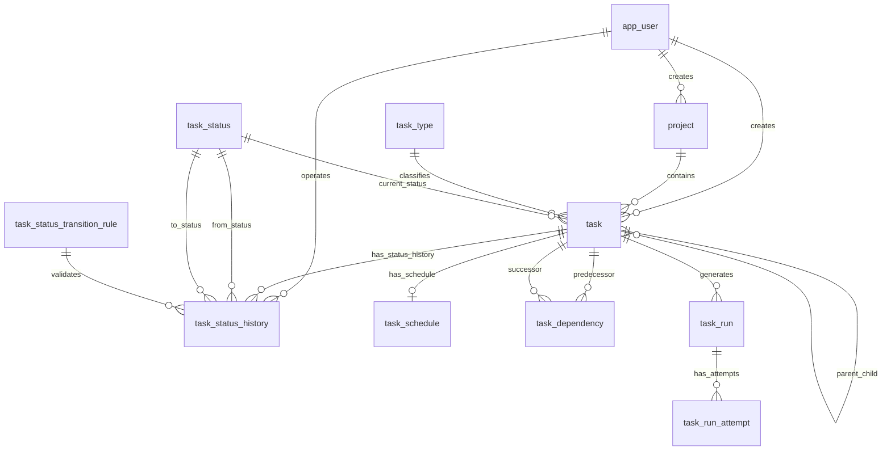
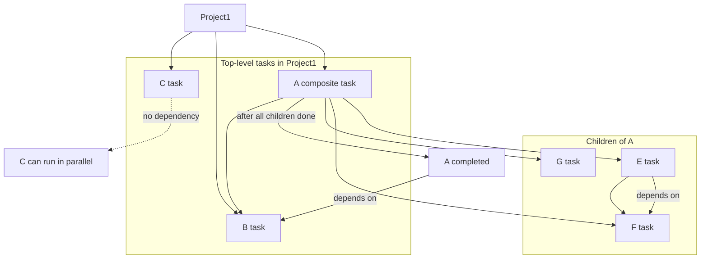
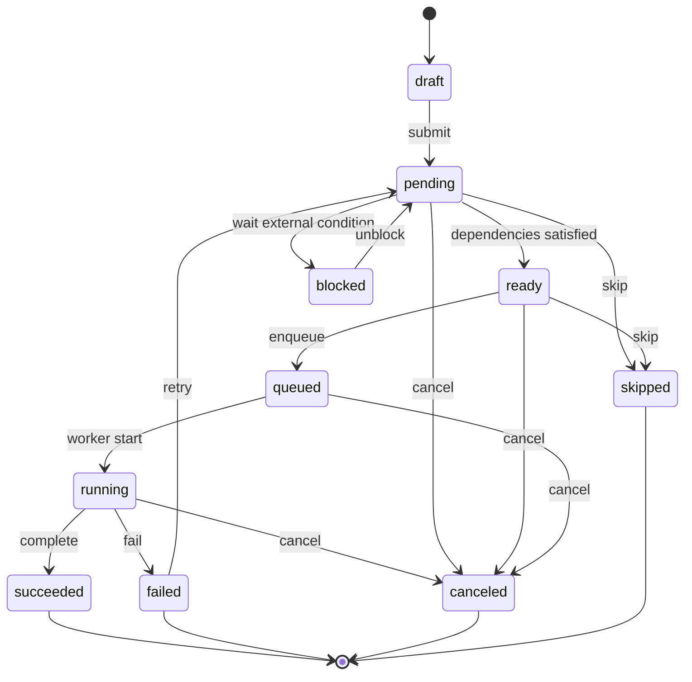
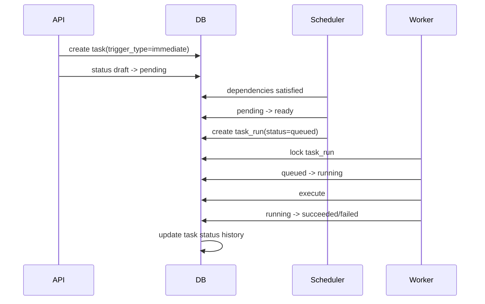
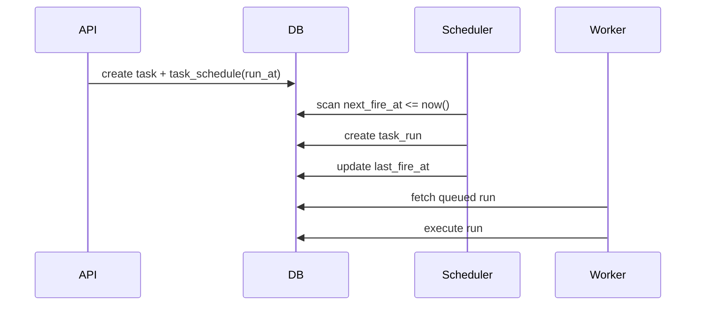

# 任务派发系统数据库设计文档

## 一、设计目标

本设计面向 Web 后端任务派发系统，数据库使用 PostgreSQL 18。系统需要支持普通任务、定时任务、周期任务、父子任务编排、项目级任务编排、任务状态流转追踪，以及后续可能扩展的重试、调度、派发、审计、软删除、多租户等能力。

本方案的核心设计思想是：

1. 项目是长期存在的业务容器，不等同于任务。
    
2. 任务既可以是可执行任务，也可以是用于编排的组合任务。
    
3. 父子结构使用任务自关联表达。
    
4. 任务之间的先后顺序使用依赖关系表表达。
    
5. 并行不需要额外建模；没有依赖关系的同级任务天然可以并行。
    
6. 当前状态保存在任务主表中，状态变化完整记录在状态历史表中。
    
7. 周期任务、定时任务不直接靠任务表本身反复改状态，而是通过调度配置和运行实例来表达每一次派发。
---

## 二、核心概念说明

### 2.1 Project：项目

项目是业务上的任务集合。例如 `Project1` 拥有 `A、B、C` 三个顶层任务。即使所有任务完成，项目仍然存在，可用于后续查看、复盘、统计、追加任务或归档。

项目本身可以有状态，例如：

|状态|含义|
|---|---|
|active|项目进行中|
|completed|项目下任务全部完成|
|archived|项目已归档，但数据仍保留|
|deleted|软删除状态，一般通过 `deleted_at` 表达|

项目不是任务，不参与任务依赖图。项目内的顶层任务通过 `project_id` 归属到项目。

---

### 2.2 Task：任务

任务是系统的核心实体。任务分为两类：

|类型|含义|是否由 worker 执行|
|---|---|---|
|atomic|原子任务，真正被派发执行|是|
|composite|组合任务，用于包含子任务和编排|否，通常由子任务状态自动推进|

例如：

`A` 是父任务，下面有 `E、F、G` 三个子任务，那么 `A` 可以设计为 `composite` 任务，`E/F/G` 是 `atomic` 或继续为 `composite`。

---

### 2.3 Task Trigger：任务触发方式

“普通任务、定时任务、周期任务”更适合建模为任务触发方式，而不是业务任务类型。

|触发方式|说明|
|---|---|
|manual|手动触发|
|immediate|创建后立即进入待派发|
|scheduled_once|在指定时间触发一次|
|recurring_cron|按 cron 表达式周期触发|
|recurring_interval|按固定间隔周期触发|
|event|由外部事件触发，预留扩展|

业务任务类型则建议单独用 `task_type` 表表达，例如：发送邮件、生成报表、同步数据、调用 webhook、执行脚本等。

---

### 2.4 Task Dependency：任务依赖

任务依赖用于表达“先后顺序”。

例如：

`A -> B` 表示 `B` 需要等待 `A` 完成后才能开始。

并行任务不需要建模。例如 `C` 与 `A/B` 并行，只需要不设置 `C` 依赖 `A` 或 `B` 即可。

---

### 2.5 Task Run：任务运行实例

任务表表示任务定义和编排节点；任务运行实例表示某一次真正执行。

为什么需要 `task_run`？

因为周期任务会执行多次。如果只在 `task` 表上反复修改状态，会丢失每次运行的独立状态、错误、结果、耗时、worker、重试记录。

推荐：

|表|职责|
|---|---|
|task|任务定义、编排节点、当前总体状态|
|task_schedule|定时/周期配置|
|task_run|某一次可派发运行实例|
|task_run_attempt|某次运行的第 N 次尝试|

---

## 三、总体 ER 图



---

## 四、业务编排示例

需求示例：

`Project1` 拥有 `A、B、C` 三个任务。

`A` 拥有 `E、F、G` 三个子任务。

`E、F` 串行。

`G` 与 `E/F` 并行。

`A、B` 串行。

`C` 与 `A/B` 并行。

对应关系如下：



数据库中表达为：

|关系|存储方式|
|---|---|
|`Project1` 包含 `A、B、C`|`task.project_id = Project1.id`，且 `parent_task_id IS NULL`|
|`A` 包含 `E、F、G`|`E/F/G.parent_task_id = A.id`|
|`E` 先于 `F`|`task_dependency.predecessor_task_id = E.id`，`successor_task_id = F.id`|
|`A` 先于 `B`|`task_dependency.predecessor_task_id = A.id`，`successor_task_id = B.id`|
|`C` 与 `A/B` 并行|不建依赖关系|
|`G` 与 `E/F` 并行|`G` 不依赖 `E/F`，`E/F` 也不依赖 `G`|
|`A` 自动完成|`A.completion_policy = all_children_succeeded`|

---

## 五、推荐数据库表设计

以下字段类型以 PostgreSQL 为准。主键推荐使用 `uuid`，可以由应用层生成，也可以通过数据库扩展生成。时间统一使用 `timestamptz`。

---

## 六、app_user：用户表

如果系统已有统一用户中心，本表可以不在任务库中维护，只保留 `created_by`、`updated_by` 等用户 ID。

|字段名|类型|是否必填|说明|
|---|--:|--:|---|
|id|uuid|是|用户 ID|
|username|text|是|用户名|
|display_name|text|否|展示名|
|email|text|否|邮箱|
|created_at|timestamptz|是|创建时间|
|deleted_at|timestamptz|否|软删除时间|

---

## 七、project：项目表

| 字段名          |          类型 | 是否必填 | 说明                                |
| ------------ | ----------: | ---: | --------------------------------- |
| id           |        uuid |    是 | 项目 ID                             |
| tenant_id    |        uuid |    否 | 租户 ID                             |
| name         |        text |    是 | 项目名称                              |
| description  |        text |    否 | 项目描述                              |
| status       |        text |    是 | 项目状态，例如 active/completed/archived |
| priority     |     integer |    是 | 项目优先级，数字越大优先级越高                   |
| started_at   | timestamptz |    否 | 项目开始时间                            |
| completed_at | timestamptz |    否 | 项目完成时间                            |
| completed_by |        uuid |    否 | 完成人                               |
| archived_at  | timestamptz |    否 | 归档时间                              |
| created_at   | timestamptz |    是 | 创建时间                              |
| created_by   |        uuid |    是 | 创建人                               |
| updated_at   | timestamptz |    是 | 更新时间                              |
| updated_by   |        uuid |    是 | 更新人                               |
| deleted_at   | timestamptz |    否 | 删除时间                              |
| deleted_by   |        uuid |    否 | 删除人                               |
| version      |      bigint |    是 | 乐观锁版本号                            |

建议约束：

```sql
ALTER TABLE project
ADD CONSTRAINT chk_project_status
CHECK (status IN ('active', 'completed', 'archived'));

CREATE INDEX idx_project_active
ON project (tenant_id, status, priority DESC, created_at DESC)
WHERE deleted_at IS NULL;
```

设计原因：

项目独立于任务存在，避免把项目伪装成一个特殊父任务。这样即使项目下所有任务完成，项目仍然可以长期保留，并且可以归档、统计、追加任务。

---

## 八、task_type：业务任务类型表

|字段名|类型|是否必填|说明|
|---|--:|--:|---|
|id|uuid|是|任务类型 ID|
|code|text|是|类型编码，例如 send_email/generate_report|
|name|text|是|类型名称|
|description|text|否|类型说明|
|default_payload_schema|jsonb|否|默认入参 schema，可选|
|is_enabled|boolean|是|是否启用|
|created_at|timestamptz|是|创建时间|
|updated_at|timestamptz|是|更新时间|

建议约束：

```sql
CREATE UNIQUE INDEX uq_task_type_code
ON task_type (code);
```

为什么不用 PostgreSQL enum 表达任务类型？

因为业务任务类型通常会扩展。使用表比 enum 更灵活，可以停用、描述、配置默认参数，也可以被后台管理页面维护。

---

## 九、task_status：任务状态字典表

|字段名|类型|是否必填|说明|
|---|--:|--:|---|
|id|uuid|是|状态 ID|
|code|text|是|状态编码|
|name|text|是|状态名称|
|is_terminal|boolean|是|是否终态|
|is_success|boolean|是|是否成功状态|
|sort_order|integer|是|展示排序|
|description|text|否|状态说明|

推荐初始状态：

|code|说明|是否终态|是否成功|
|---|---|--:|--:|
|draft|草稿|否|否|
|pending|等待调度或依赖|否|否|
|ready|依赖已满足，可派发|否|否|
|queued|已进入执行队列|否|否|
|running|执行中|否|否|
|blocked|被依赖、人工审批或外部条件阻塞|否|否|
|paused|暂停|否|否|
|succeeded|成功完成|是|是|
|failed|失败|是|否|
|canceled|已取消|是|否|
|skipped|已跳过|是|是|

设计原因：

状态使用字典表，而不是 enum，可以让状态展示、终态判断、成功判断更加灵活。状态编码仍然需要受控，不能任意写入。

---

## 十、task_status_transition_rule：状态流转规则表

|字段名|类型|是否必填|说明|
|---|--:|--:|---|
|id|uuid|是|规则 ID|
|from_status_id|uuid|是|原状态|
|to_status_id|uuid|是|目标状态|
|action_code|text|否|触发动作，例如 start/complete/fail/cancel|
|is_enabled|boolean|是|是否启用|
|description|text|否|规则说明|

示例规则：

|from|to|action|
|---|---|---|
|draft|pending|submit|
|pending|ready|dependencies_satisfied|
|ready|queued|enqueue|
|queued|running|worker_start|
|running|succeeded|complete|
|running|failed|fail|
|pending|canceled|cancel|
|ready|canceled|cancel|
|failed|pending|retry|

设计原因：

任务状态流转是任务派发系统的关键业务规则。单独建规则表后，可以统一校验状态变化，避免应用代码在多个地方散落判断。

---

## 十一、task：任务主表

|字段名|类型|是否必填|说明|
|---|--:|--:|---|
|id|uuid|是|任务 ID|
|tenant_id|uuid|否|租户 ID|
|project_id|uuid|否|所属项目 ID|
|parent_task_id|uuid|否|父任务 ID|
|task_type_id|uuid|是|业务任务类型|
|current_status_id|uuid|是|当前状态|
|name|text|是|任务名称|
|detail|text|否|任务详情|
|task_kind|text|是|atomic/composite|
|trigger_type|text|是|manual/immediate/scheduled_once/recurring_cron/recurring_interval/event|
|priority|integer|是|优先级，数字越大越优先|
|payload|jsonb|否|任务输入参数|
|result|jsonb|否|任务最终结果摘要|
|completion_policy|text|是|父任务完成策略|
|failure_policy|text|是|子任务失败时父任务策略|
|max_retry|integer|是|最大重试次数|
|retry_backoff_seconds|integer|是|重试退避秒数|
|timeout_seconds|integer|否|单次运行超时时间|
|due_at|timestamptz|否|期望完成时间|
|completed_at|timestamptz|否|完成时间|
|completed_by|uuid|否|完成人|
|created_at|timestamptz|是|创建时间|
|created_by|uuid|是|创建人|
|updated_at|timestamptz|是|更新时间|
|updated_by|uuid|是|更新人|
|deleted_at|timestamptz|否|删除时间|
|deleted_by|uuid|否|删除人|
|version|bigint|是|乐观锁版本号|

推荐约束：

```sql
ALTER TABLE task
ADD CONSTRAINT chk_task_kind
CHECK (task_kind IN ('atomic', 'composite'));

ALTER TABLE task
ADD CONSTRAINT chk_task_trigger_type
CHECK (
    trigger_type IN (
        'manual',
        'immediate',
        'scheduled_once',
        'recurring_cron',
        'recurring_interval',
        'event'
    )
);

ALTER TABLE task
ADD CONSTRAINT chk_task_completion_policy
CHECK (
    completion_policy IN (
        'manual',
        'all_children_succeeded',
        'all_children_terminal',
        'any_child_succeeded'
    )
);

ALTER TABLE task
ADD CONSTRAINT chk_task_failure_policy
CHECK (
    failure_policy IN (
        'ignore',
        'fail_parent',
        'block_parent',
        'cancel_remaining'
    )
);
```

推荐索引：

```sql
CREATE INDEX idx_task_project_top_level
ON task (project_id, priority DESC, created_at)
WHERE parent_task_id IS NULL AND deleted_at IS NULL;

CREATE INDEX idx_task_parent
ON task (parent_task_id, priority DESC, created_at)
WHERE deleted_at IS NULL;

CREATE INDEX idx_task_status
ON task (current_status_id, priority DESC, updated_at)
WHERE deleted_at IS NULL;

CREATE INDEX idx_task_payload_gin
ON task USING gin (payload);
```

设计原因：

`task` 表保存任务当前状态和核心信息。父子关系直接通过 `parent_task_id` 表达，简单直观。任务依赖关系不放在任务表中，而是单独用 `task_dependency` 表表达，这样可以支持复杂 DAG 编排。

---

## 十二、task_dependency：任务依赖表

|字段名|类型|是否必填|说明|
|---|--:|--:|---|
|id|uuid|是|依赖关系 ID|
|tenant_id|uuid|否|租户 ID|
|project_id|uuid|否|所属项目 ID，冗余字段，便于查询和校验|
|predecessor_task_id|uuid|是|前置任务|
|successor_task_id|uuid|是|后置任务|
|dependency_condition|text|是|前置任务满足什么条件后释放后置任务|
|dependency_kind|text|是|依赖类型，默认 finish_to_start|
|created_at|timestamptz|是|创建时间|
|created_by|uuid|是|创建人|
|deleted_at|timestamptz|否|删除时间|
|deleted_by|uuid|否|删除人|

推荐约束：

```sql
ALTER TABLE task_dependency
ADD CONSTRAINT chk_task_dependency_not_self
CHECK (predecessor_task_id <> successor_task_id);

ALTER TABLE task_dependency
ADD CONSTRAINT chk_task_dependency_condition
CHECK (
    dependency_condition IN (
        'succeeded',
        'completed',
        'failed',
        'always'
    )
);

ALTER TABLE task_dependency
ADD CONSTRAINT chk_task_dependency_kind
CHECK (
    dependency_kind IN (
        'finish_to_start'
    )
);

CREATE UNIQUE INDEX uq_task_dependency_active
ON task_dependency (predecessor_task_id, successor_task_id, dependency_condition)
WHERE deleted_at IS NULL;

CREATE INDEX idx_task_dependency_successor
ON task_dependency (successor_task_id)
WHERE deleted_at IS NULL;

CREATE INDEX idx_task_dependency_predecessor
ON task_dependency (predecessor_task_id)
WHERE deleted_at IS NULL;
```

设计原因：

串行关系本质上是有向边。多个任务之间的编排是一个 DAG，即有向无环图。并行任务不需要建边，这样模型更简洁。

需要注意：

数据库需要防止依赖成环。例如不能出现：

```text
A -> B -> C -> A
```

推荐通过数据库触发器或应用服务，在新增依赖时使用递归查询检测是否成环。

---

## 十三、task_schedule：任务调度配置表

|字段名|类型|是否必填|说明|
|---|--:|--:|---|
|id|uuid|是|调度配置 ID|
|task_id|uuid|是|任务 ID|
|schedule_kind|text|是|once/cron/interval|
|run_at|timestamptz|否|一次性任务触发时间|
|cron_expression|text|否|cron 表达式|
|interval_seconds|integer|否|固定间隔秒数|
|timezone|text|是|时区，例如 Asia/Shanghai|
|start_at|timestamptz|否|周期开始时间|
|end_at|timestamptz|否|周期结束时间|
|next_fire_at|timestamptz|否|下一次触发时间|
|last_fire_at|timestamptz|否|上一次触发时间|
|max_fire_count|integer|否|最大触发次数|
|fired_count|integer|是|已触发次数|
|misfire_policy|text|是|错过调度时的处理策略|
|is_enabled|boolean|是|是否启用|
|created_at|timestamptz|是|创建时间|
|created_by|uuid|是|创建人|
|updated_at|timestamptz|是|更新时间|
|updated_by|uuid|是|更新人|
|deleted_at|timestamptz|否|删除时间|
|deleted_by|uuid|否|删除人|

推荐约束：

```sql
ALTER TABLE task_schedule
ADD CONSTRAINT chk_task_schedule_kind
CHECK (schedule_kind IN ('once', 'cron', 'interval'));

ALTER TABLE task_schedule
ADD CONSTRAINT chk_task_schedule_misfire_policy
CHECK (misfire_policy IN ('skip', 'fire_once', 'fire_all'));

CREATE UNIQUE INDEX uq_task_schedule_task_active
ON task_schedule (task_id)
WHERE deleted_at IS NULL;

CREATE INDEX idx_task_schedule_next_fire
ON task_schedule (next_fire_at)
WHERE is_enabled = true AND deleted_at IS NULL;
```

设计原因：

调度配置与任务主表分离，可以避免任务表字段过多，也方便后续扩展 cron、固定间隔、节假日排除、调度窗口、错过执行策略等能力。

---

## 十四、task_run：任务运行实例表

|字段名|类型|是否必填|说明|
|---|--:|--:|---|
|id|uuid|是|运行实例 ID|
|tenant_id|uuid|否|租户 ID|
|task_id|uuid|是|任务 ID|
|schedule_id|uuid|否|来源调度配置|
|scheduled_fire_at|timestamptz|否|理论触发时间|
|available_at|timestamptz|是|最早可执行时间|
|status|text|是|queued/running/succeeded/failed/canceled/dead_letter|
|priority|integer|是|运行实例优先级|
|payload_snapshot|jsonb|否|执行时参数快照|
|result|jsonb|否|执行结果|
|error_code|text|否|错误码|
|error_message|text|否|错误信息|
|attempt_count|integer|是|已尝试次数|
|max_attempt|integer|是|最大尝试次数|
|locked_by|text|否|当前锁定 worker|
|locked_until|timestamptz|否|锁定过期时间|
|started_at|timestamptz|否|开始执行时间|
|completed_at|timestamptz|否|完成时间|
|idempotency_key|text|否|幂等键|
|created_at|timestamptz|是|创建时间|
|updated_at|timestamptz|是|更新时间|
|deleted_at|timestamptz|否|删除时间|

推荐约束：

```sql
ALTER TABLE task_run
ADD CONSTRAINT chk_task_run_status
CHECK (
    status IN (
        'queued',
        'running',
        'succeeded',
        'failed',
        'canceled',
        'dead_letter'
    )
);

CREATE INDEX idx_task_run_dispatch
ON task_run (priority DESC, available_at, created_at)
WHERE status = 'queued' AND deleted_at IS NULL;

CREATE INDEX idx_task_run_locked_expired
ON task_run (locked_until)
WHERE status = 'running' AND locked_until IS NOT NULL;

CREATE UNIQUE INDEX uq_task_run_idempotency
ON task_run (idempotency_key)
WHERE idempotency_key IS NOT NULL;
```

派发时可采用类似逻辑：

```sql
SELECT id
FROM task_run
WHERE status = 'queued'
  AND available_at <= now()
  AND deleted_at IS NULL
ORDER BY priority DESC, available_at ASC, created_at ASC
FOR UPDATE SKIP LOCKED
LIMIT 100;
```

设计原因：

`task_run` 是真正面向 worker 的队列表。这样任务定义、任务编排、任务执行历史三者不会混在一起。

---

## 十五、task_run_attempt：任务运行尝试表

|字段名|类型|是否必填|说明|
|---|--:|--:|---|
|id|uuid|是|尝试 ID|
|task_run_id|uuid|是|运行实例 ID|
|attempt_no|integer|是|第几次尝试|
|worker_id|text|否|执行 worker|
|status|text|是|running/succeeded/failed/timeout|
|started_at|timestamptz|是|开始时间|
|finished_at|timestamptz|否|结束时间|
|duration_ms|bigint|否|耗时|
|error_code|text|否|错误码|
|error_message|text|否|错误信息|
|error_stack|text|否|错误堆栈|
|result|jsonb|否|尝试结果|
|created_at|timestamptz|是|创建时间|

推荐约束：

```sql
CREATE UNIQUE INDEX uq_task_run_attempt_no
ON task_run_attempt (task_run_id, attempt_no);

CREATE INDEX idx_task_run_attempt_run
ON task_run_attempt (task_run_id, attempt_no DESC);
```

设计原因：

任务失败重试时，每次尝试都应该有独立记录，便于排查问题、统计成功率、识别不稳定 worker。

---

## 十六、task_status_history：任务状态流转历史表

|字段名|类型|是否必填|说明|
|---|--:|--:|---|
|id|uuid|是|历史 ID|
|task_id|uuid|是|任务 ID|
|seq|bigint|是|任务内状态流转序号|
|previous_history_id|uuid|否|上一条状态历史 ID|
|from_status_id|uuid|否|原状态；首次创建可为空|
|to_status_id|uuid|是|新状态|
|transition_rule_id|uuid|否|命中的状态流转规则|
|action_code|text|否|动作编码|
|reason|text|否|变更原因|
|metadata|jsonb|否|附加信息|
|operated_at|timestamptz|是|操作时间|
|operated_by|uuid|否|操作人；系统自动流转可为空|
|request_id|text|否|请求链路 ID|
|created_at|timestamptz|是|创建时间|

推荐约束：

```sql
CREATE UNIQUE INDEX uq_task_status_history_seq
ON task_status_history (task_id, seq);

CREATE INDEX idx_task_status_history_task
ON task_status_history (task_id, operated_at DESC);

CREATE INDEX idx_task_status_history_to_status
ON task_status_history (to_status_id, operated_at DESC);
```

设计原因：

任务主表只保存当前状态，历史表保存完整链路。`seq` 和 `previous_history_id` 可以明确表达状态流转链，满足审计和排障需求。

推荐实践：

不要让业务代码直接更新 `task.current_status_id`。应封装一个数据库函数或应用层事务方法：

```text
change_task_status(task_id, to_status, action_code, reason, operator)
```

该方法需要在一个事务中完成：

1. 锁定 task 行。
    
2. 校验状态流转是否合法。
    
3. 更新 task 当前状态。
    
4. 写入 task_status_history。
    
5. 如果进入终态，补充 completed_at/completed_by。
    
6. 检查父任务是否可自动完成。
    
7. 检查依赖它的后置任务是否可以进入 ready。
    

---

## 十七、状态机设计

推荐状态机如下：



状态说明：

|状态|说明|
|---|---|
|draft|草稿态，尚未进入调度|
|pending|等待依赖、等待调度或等待人工提交|
|ready|依赖满足，可以派发|
|queued|已生成运行实例，等待 worker 获取|
|running|执行中|
|blocked|被外部条件阻塞|
|paused|暂停|
|succeeded|成功|
|failed|失败|
|canceled|取消|
|skipped|跳过|

---

## 十八、父任务自动完成规则

父任务是否自动完成，由 `task.completion_policy` 决定。

|completion_policy|含义|
|---|---|
|manual|不自动完成，需要人工或业务系统完成|
|all_children_succeeded|所有子任务成功后自动成功|
|all_children_terminal|所有子任务进入终态后自动完成|
|any_child_succeeded|任意一个子任务成功后自动完成|

父任务失败策略由 `failure_policy` 决定。

|failure_policy|含义|
|---|---|
|ignore|子任务失败不影响父任务|
|fail_parent|任意关键子任务失败则父任务失败|
|block_parent|子任务失败后父任务进入 blocked|
|cancel_remaining|子任务失败后取消未开始的同级任务|

推荐默认值：

```text
completion_policy = all_children_succeeded
failure_policy = fail_parent
```

父任务自动完成判断逻辑：

```sql
-- 伪 SQL
-- 当某个子任务进入终态后，检查它的 parent_task_id
-- 如果父任务所有未删除子任务都已经 succeeded，则父任务进入 succeeded
```

---

## 十九、依赖释放规则

某个任务完成后，需要检查它的后置任务是否可以启动。

后置任务可以进入 `ready` 的条件：

1. 后置任务未删除。
    
2. 后置任务当前状态是 `pending` 或 `blocked`。
    
3. 所有有效前置依赖均已满足。
    
4. 如果后置任务属于某个父任务，则父任务未取消、未失败、未删除。
    
5. 如果后置任务有调度时间，则当前时间不能早于调度时间。
    
6. 如果后置任务是 atomic，则可以生成或释放 `task_run`。
    
7. 如果后置任务是 composite，则递归释放其无依赖的子任务。
    

---

## 二十、调度与派发流程

### 20.1 普通立即任务



---

### 20.2 定时任务



---

### 20.3 周期任务

周期任务不会在每次执行后把任务本身标记为最终完成，除非周期结束。

推荐行为：

|对象|行为|
|---|---|
|task|表示周期任务定义，长期存在|
|task_schedule|保存 cron/interval 和下一次触发时间|
|task_run|每次触发生成一条|
|task_run_attempt|每次重试生成一条|

当达到 `end_at` 或 `max_fire_count` 后，可以将任务状态改为 `succeeded` 或 `completed`。

---

## 二十一、软删除设计

所有核心业务表建议使用软删除：

```text
deleted_at timestamptz
deleted_by uuid
```

软删除原因：

1. 保留审计记录。
    
2. 保留任务状态链。
    
3. 避免删除父任务导致子任务历史丢失。
    
4. 方便恢复误删数据。
    

注意：

1. 查询业务数据时必须加 `deleted_at IS NULL`。
    
2. 唯一索引应使用部分唯一索引，只约束未删除数据。
    
3. 软删除父任务时，建议由应用服务递归软删除子任务和依赖关系，不建议直接数据库级联物理删除。
    

---

## 二十二、审计字段规范

任务需包含：

|字段|说明|
|---|---|
|created_at|创建时间|
|created_by|创建人|
|updated_at|更新时间|
|updated_by|更新人|
|completed_at|完成时间|
|completed_by|完成人|
|deleted_at|删除时间|
|deleted_by|删除人|

建议所有核心表统一使用类似审计字段，至少包括：

```sql
created_at timestamptz NOT NULL DEFAULT now(),
created_by uuid NOT NULL,
updated_at timestamptz NOT NULL DEFAULT now(),
updated_by uuid NOT NULL,
deleted_at timestamptz NULL,
deleted_by uuid NULL
```

任务状态变更的审计不要只依赖 `updated_at`，必须写入 `task_status_history`。

---

## 二十三、关键约束设计

### 23.1 防止父子任务成环

错误示例：

```text
A.parent = B
B.parent = C
C.parent = A
```

推荐处理：

新增或修改 `parent_task_id` 时，使用递归查询检查新的父任务是否已经是当前任务的子孙节点。

---

### 23.2 防止任务依赖成环

错误示例：

```text
A -> B -> C -> A
```

推荐处理：

新增 `task_dependency` 时，从 `successor_task_id` 开始向后查找，如果能找到 `predecessor_task_id`，说明新增边会形成环，应拒绝。

---

### 23.3 限制依赖作用域

推荐默认限制：

1. 顶层任务只能依赖同项目下的顶层任务。
    
2. 子任务只能依赖同一父任务下的兄弟任务。
    
3. 不建议跨项目依赖。
    
4. 不建议父任务直接依赖自己的孙任务。
    

这样做的原因：

复杂跨层依赖虽然灵活，但会显著增加调度判断难度，也容易出现“看不懂的流程图”。

如果确实需要跨项目依赖，建议单独设计 `external_dependency` 或 `project_dependency`，不要混入普通 `task_dependency`。

---

## 二十四、索引设计建议

### 24.1 项目查询

```sql
CREATE INDEX idx_project_active
ON project (tenant_id, status, priority DESC, created_at DESC)
WHERE deleted_at IS NULL;
```

适用场景：

1. 查询当前租户项目列表。
    
2. 查询进行中的项目。
    
3. 按优先级排序。
    

---

### 24.2 任务树查询

```sql
CREATE INDEX idx_task_parent
ON task (parent_task_id, priority DESC, created_at)
WHERE deleted_at IS NULL;
```

适用场景：

1. 查询某个父任务下的子任务。
    
2. 展示任务树。
    
3. 判断父任务是否可完成。
    

---

### 24.3 项目顶层任务查询

```sql
CREATE INDEX idx_task_project_top_level
ON task (project_id, priority DESC, created_at)
WHERE parent_task_id IS NULL AND deleted_at IS NULL;
```

适用场景：

1. 查询项目下的顶层任务。
    
2. 展示项目编排图。
    

---

### 24.4 依赖查询

```sql
CREATE INDEX idx_task_dependency_predecessor
ON task_dependency (predecessor_task_id)
WHERE deleted_at IS NULL;

CREATE INDEX idx_task_dependency_successor
ON task_dependency (successor_task_id)
WHERE deleted_at IS NULL;
```

适用场景：

1. 某任务完成后查找后置任务。
    
2. 判断某任务所有前置依赖是否满足。
    

---

### 24.5 派发队列查询

```sql
CREATE INDEX idx_task_run_dispatch
ON task_run (priority DESC, available_at, created_at)
WHERE status = 'queued' AND deleted_at IS NULL;
```

适用场景：

worker 扫描可执行任务。

---

### 24.6 状态历史查询

```sql
CREATE INDEX idx_task_status_history_task
ON task_status_history (task_id, operated_at DESC);
```

适用场景：

1. 查看任务状态流转链。
    
2. 审计某个任务的完整生命周期。
    

---

## 二十五、可选优化：任务层级查询方案

任务父子结构有多种建模方式。

### 25.1 方案一：邻接表

即本方案使用的方式：

```text
task.parent_task_id -> task.id
```

优点：

1. 简单。
    
2. 写入成本低。
    
3. 容易理解。
    
4. 适合大多数业务系统。
    
5. 与任务依赖 DAG 表配合自然。
    

缺点：

1. 查询整棵树需要递归查询。
    
2. 深层级树查询性能依赖索引和数据规模。
    

适用场景：

任务层级不会特别深，通常几十层以内；单个项目任务数量在可控范围内。

---

### 25.2 方案二：闭包表

新增表：

```text
task_closure(ancestor_task_id, descendant_task_id, depth)
```

优点：

1. 查询所有子孙节点非常快。
    
2. 查询所有祖先节点也很快。
    
3. 适合深层级任务树。
    

缺点：

1. 写入复杂。
    
2. 移动子树复杂。
    
3. 存储量更大。
    
4. 需要维护闭包数据一致性。
    

适用场景：

任务树非常深，且经常查询整棵树或任意节点的所有祖先/子孙。

---

### 25.3 方案三：ltree 路径

为任务维护类似路径：

```text
root.A.E
root.A.F
root.A.G
```

优点：

1. 查询子树方便。
    
2. 路径可读性好。
    
3. 可以使用专门索引优化路径查询。
    

缺点：

1. 移动节点需要更新整棵子树路径。
    
2. 需要额外扩展。
    
3. 对任务 ID 到合法 label 的转换需要规范。
    

适用场景：

层级查询非常频繁，任务移动较少。

---

### 25.4 方案四：嵌套集

通过 `left_value/right_value` 表达树。

优点：

1. 查询子树快。
    
2. 适合读多写少的树。
    

缺点：

1. 插入、移动、删除节点成本高。
    
2. 不适合任务这种经常变化的业务流程。
    

适用场景：

几乎静态的分类树，不推荐用于任务系统。

---

### 25.5 本方案选择理由

本系统推荐：

```text
邻接表 + task_dependency DAG
```

原因：

1. 任务创建、取消、重试、追加子任务都很常见，写入灵活性优先。
    
2. 父子结构和依赖顺序是两个不同维度，不能混在一个字段里。
    
3. 并行通过“无依赖边”表达，简单自然。
    
4. 后续如遇性能瓶颈，可以无痛增加闭包表或 ltree 路径作为读优化。
    

---

## 二十六、可选优化：历史表分区

以下表可能长期快速增长：

1. `task_status_history`
    
2. `task_run`
    
3. `task_run_attempt`
    

建议按时间分区，例如按月分区：

```text
task_status_history_2026_01
task_status_history_2026_02
task_status_history_2026_03
```

优点：

1. 历史查询范围更小。
    
2. 归档和清理更方便。
    
3. 减少单表膨胀。
    
4. 便于冷热数据分离。
    

---

## 二十七、API 层推荐事务边界

### 27.1 创建项目和任务编排

一个事务内完成：

1. 创建 project。
    
2. 创建顶层 task。
    
3. 创建子 task。
    
4. 创建 task_dependency。
    
5. 初始化 task_status_history。
    
6. 检查父子结构是否成环。
    
7. 检查依赖图是否成环。
    

---

### 27.2 任务状态变更

一个事务内完成：

1. 锁定 task。
    
2. 校验当前状态。
    
3. 校验目标状态是否合法。
    
4. 更新 task。
    
5. 插入 task_status_history。
    
6. 如果任务完成，检查后置任务。
    
7. 如果任务有父任务，检查父任务自动完成。
    
8. 如果项目下所有顶层任务完成，更新 project.status。
    

---

### 27.3 worker 获取任务

一个事务内完成：

1. 从 `task_run` 中选择 queued 且 available_at 到期的数据。
    
2. 使用行锁跳过其他 worker 已锁定的数据。
    
3. 更新状态为 running。
    
4. 写入 task_run_attempt。
    
5. 提交事务。
    
6. worker 执行业务逻辑。
    
7. 执行完成后再次开启事务更新结果。
    

---

## 二十八、数据一致性建议

### 28.1 乐观锁

核心表建议使用 `version` 字段。

更新时：

```sql
UPDATE task
SET
    name = :name,
    version = version + 1,
    updated_at = now()
WHERE id = :id
  AND version = :old_version;
```

如果影响行数为 0，说明发生并发修改。

---

### 28.2 幂等键

`task_run.idempotency_key` 用于防止重复派发。

例如：

```text
task_id + scheduled_fire_at
```

周期任务在同一理论触发时间只能生成一个运行实例。

---

### 28.3 Outbox 模式

如果任务状态变化后需要发送消息到 MQ，建议增加 `outbox_event` 表。

|字段|说明|
|---|---|
|id|事件 ID|
|aggregate_type|聚合类型，例如 task|
|aggregate_id|聚合 ID|
|event_type|事件类型|
|payload|事件内容|
|status|pending/published/failed|
|created_at|创建时间|
|published_at|发布时间|

设计原因：

数据库状态更新和消息发送无法天然保证原子性。Outbox 模式可以避免“数据库成功但消息丢失”的问题。

---

## 二十九、权限与多租户建议

如果系统是 SaaS 或多组织系统，建议所有核心表加 `tenant_id`。

关键规则：

1. 所有查询必须带 `tenant_id`。
    
2. 所有外键关联的数据必须属于同一租户。
    
3. 后台管理接口也不能绕过租户隔离。
    
4. 可以考虑 PostgreSQL Row Level Security，但业务复杂时也要配合应用层校验。
    

---

## 三十、与其他方案对比

### 30.1 把项目也设计成一种任务

|方案|优点|缺点|
|---|---|---|
|项目也是任务|模型统一，项目也能参与依赖|项目生命周期与任务混淆；所有任务完成后项目状态语义不清；项目统计、归档、权限复杂|
|项目独立建表|项目长期存在，语义清晰，便于统计和归档|多一张表，需要维护项目状态|

推荐选择：项目独立建表。

原因：

项目是业务容器，不是一次执行单元。项目完成后仍应存在，这一点与任务生命周期不同。

---

### 30.2 用 task.parent_task_id 表达顺序

|方案|优点|缺点|
|---|---|---|
|parent_task_id 同时表达父子和顺序|表少|语义混乱，无法表达复杂并行和串行关系|
|parent_task_id 表达层级，dependency 表表达顺序|语义清晰，支持 DAG|多一张依赖表|

推荐选择：父子关系和依赖关系分离。

原因：

父子关系表达“包含”，依赖关系表达“先后”。这是两个不同概念。

---

### 30.3 用 sort_order 表达任务顺序

|方案|优点|缺点|
|---|---|---|
|sort_order|简单，适合纯线性流程|无法表达并行，无法表达复杂依赖|
|dependency DAG|支持串行、并行、复杂编排|需要检测环，调度逻辑更复杂|

推荐选择：dependency DAG。

原因：

需求中明确存在“部分串行 + 部分并行”，`sort_order` 不够表达。

---

### 30.4 状态历史只存操作日志

|方案|优点|缺点|
|---|---|---|
|普通操作日志|通用|很难准确还原状态链|
|task_status_history|专门记录状态变化，链路清晰|多一张表|

推荐选择：专门的状态历史表。

原因：

状态流转链是核心需求，不应该混在普通日志中。

---

### 30.5 周期任务直接更新 task 状态

|方案|优点|缺点|
|---|---|---|
|直接更新 task|表少|丢失每次执行记录，不利于重试、统计、排障|
|task + schedule + run|生命周期清晰|表更多|

推荐选择：`task + task_schedule + task_run + task_run_attempt`。

原因：

派发系统最重要的是每次执行的可追踪性。周期任务必须保留每次运行实例。

---

## 三十一、推荐最小落地版本

如果第一阶段不想一次实现太多，可以先落地以下表：

1. `project`
    
2. `task_type`
    
3. `task_status`
    
4. `task`
    
5. `task_dependency`
    
6. `task_schedule`
    
7. `task_run`
    
8. `task_status_history`
    

第二阶段再增加：

1. `task_run_attempt`
    
2. `task_status_transition_rule`
    
3. `outbox_event`
    
4. `task_closure` 或 `ltree` 路径
    
5. 历史表分区
    
6. 标签、评论、附件、审批流
    

---

## 三十二、后续可能需要补充的功能

### 32.1 优先级

任务和运行实例都建议有 `priority`。项目优先级、任务优先级、运行实例优先级可以叠加计算。

---

### 32.2 截止时间

增加 `due_at`，用于 SLA、超时提醒、排序。

---

### 32.3 超时控制

`timeout_seconds` 用于 worker 判断任务是否超时。

---

### 32.4 人工审批

某些任务可能需要人工确认后才能继续。可以使用：

```text
status = blocked
blocked_reason = approval_required
```

后续如审批复杂，可以新增 `task_approval` 表。

---

### 32.5 标签

可增加：

```text
task_tag
task_tag_relation
```

便于筛选和统计。

---

### 32.6 附件与评论

可增加：

```text
task_comment
task_attachment
```

适合协作型任务系统。

---

### 32.7 失败死信队列

`task_run.status = dead_letter` 表示超过最大重试次数后进入死信状态，需要人工处理。

---

### 32.8 任务模板

如果很多项目具有相同任务结构，可以增加：

```text
task_template
task_template_node
task_template_dependency
```

创建项目时从模板复制出实际任务。

---

## 三十三、总结

本设计的核心是：

```text
project 独立存在
task 表达任务节点
parent_task_id 表达父子包含关系
task_dependency 表达先后依赖关系
task_schedule 表达定时/周期配置
task_run 表达每次派发执行
task_status_history 表达状态流转链
```

对于示例：

```text
Project1:
  A -> B
  C 与 A/B 并行

A:
  E -> F
  G 与 E/F 并行
```

可以自然表达为：

1. `A、B、C` 是同一项目的顶层任务。
    
2. `E、F、G` 是 `A` 的子任务。
    
3. `E -> F` 写入 `task_dependency`。
    
4. `A -> B` 写入 `task_dependency`。
    
5. `C` 不写依赖，因此并行。
    
6. `G` 不写依赖，因此并行。
    
7. `A` 的完成由子任务完成状态自动推进。
    
8. 项目完成后仍保留项目记录。
    

该方案在表达能力、可维护性、扩展性和数据库一致性之间较均衡，适合作为 Web 后端任务派发系统的基础数据库模型。